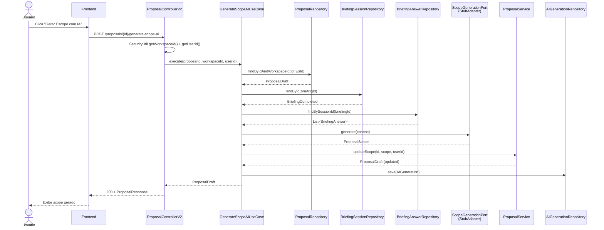

# Design: Geração de Scope via IA

**Status:** Proposto
**Data:** 2026-04-21
**Autor:** architect

---

## Contexto

Propostas são criadas com `scope = null`. O usuário não consegue publicar sem scope (`ProposalDraft.publish()` lança `InvalidProposalStateException`). Precisamos de um endpoint que gere scope automaticamente via LLM baseado no briefing completo, preenchendo deliverables, exclusões, assumptions, preço e timeline.

**Restrições:**
- Adapters OpenAI/S3 são Phase 4 (pendente) — não há integração real com LLM
- `ProposalScope` já é um record rico com `Deliverable`, `Price`, `Timeline`, `Milestone`
- `BriefingCompleted.isReady()` valida completeness >= 80%
- `ai_generations` table já existe com audit trail completo
- `GenerationType` enum já tem 4 valores; precisa de novo: `SCOPE_GENERATION`
- `ProposalService.updateScope()` já funciona — podemos reusar

---

## Decisões Arquiteturais

### 1. Stub vs Real LLM

**Decisão:** Stub agora + output port para troca futura.

**Justificativa:** Phase 4 ainda não chegou. O padrão hexagonal já nos dá o mecanismo perfeito: criar `ScopeGenerationPort` (output port na camada application) e `StubScopeGenerationAdapter` (adapter out). Quando o LLM real chegar, basta implementar `OpenAIScopeGenerationAdapter` sem tocar em domain ou application.

**Trade-offs:**
| | Stub + Port | Esperar Phase 4 |
|---|---|---|
| **Prós** | Desbloqueia frontend agora; valida fluxo E2E; contrato da interface estabiliza antes do LLM | Sem código descartável |
| **Contras** | Stub gera scope genérico (UX limitada) | Bloqueia feature por tempo indeterminado |
| **Reversibilidade** | Alta — trocar adapter é 1 classe | N/A |

O stub gera scope determinístico baseado em `serviceType` do briefing. Isso permite testar todo o fluxo (frontend → API → domain → persist) sem dependência externa.

### 2. Fluxo Síncrono vs Assíncrono

**Decisão:** Síncrono para MVP (stub). Preparar para async no futuro.

**Justificativa:**

| | Síncrono | Assíncrono (202 + polling) |
|---|---|---|
| **Prós** | Simples; stub responde em <50ms; frontend trivial (loading spinner) | Suporta LLM real (3-10s); não bloqueia thread |
| **Contras** | LLM real pode causar timeout (>30s) | Complexidade: polling/SSE, status intermediário, retry | 
| **Reversibilidade** | Média — mudar para async requer novo endpoint + status | Alta — async suporta ambos |

**Para MVP stub:** síncrono é suficiente e muito mais simples. O endpoint retorna `ProposalResponse` direto.

**Migração futura para async:** quando LLM real chegar, o endpoint muda para retornar `202 Accepted` + `Location` header. O `ScopeGenerationPort` já abstrai isso — a mudança fica contida no controller + adapter, sem tocar em domain.

### 3. Estrutura de Service

**Decisão:** Novo `AIScopeGenerationUseCase` na camada application, não no domain service.

**Justificativa:** A geração de scope é orquestração (busca briefing → chama IA → atualiza proposal). Não é regra de negócio pura. Pertence à camada application.

```
application/
└── usecase/
    └── GenerateScopeAIUseCase.java    # Orquestra o fluxo

application/port/out/
└── ScopeGenerationPort.java           # Interface para LLM

adapter/out/ai/
└── StubScopeGenerationAdapter.java    # Stub determinístico
```

O use case depende de:
- `ProposalRepository` — buscar proposal (validar DRAFT)
- `BriefingSessionRepository` — buscar briefing (validar COMPLETED + isReady)
- `BriefingAnswerRepository` — buscar respostas para input do LLM
- `ScopeGenerationPort` — chamar geração (stub ou real)
- `ProposalService.updateScope()` — persistir scope gerado
- `AIGenerationRepository` — registrar audit trail

### 4. Validações

**Decisão:** Validação em camadas — controller valida input, use case valida regras de negócio.

| Validação | Onde | Error Code | HTTP |
|-----------|------|------------|------|
| Proposal não encontrada | Use case | `PROPOSAL-001` (existente) | 404 |
| Proposal não é DRAFT | Use case | `PROPOSAL-011` (novo) | 409 |
| Briefing não encontrado | Use case | `PROPOSAL-010` (novo) | 404 |
| Briefing não está COMPLETED | Use case | `PROPOSAL-013` (novo) | 422 |
| Briefing não está ready (<80%) | Use case | `PROPOSAL-014` (novo) | 422 |
| AI service indisponível | Adapter (CB) | `PROPOSAL-012` (novo) | 503 |

**Workspace isolation:** O controller extrai `workspaceId` do JWT via `SecurityUtil.getWorkspaceId()` e o use case valida que a proposal pertence ao workspace.

### 5. Dados do Stub

**Decisão:** Scope determinístico baseado em `ServiceType` do briefing.

```java
// StubScopeGenerationAdapter retorna scope fixo por serviceType:
// - 3 deliverables contextuais (nome/descrição variam por serviceType)
// - Price: BRL 5.000,00 (breakdown: "Estimativa baseada em projetos similares")
// - Timeline: hoje + 30 dias, 2 milestones (kick-off + entrega)
// - 2 exclusions padrão ("Alterações de escopo após aprovação", "Conteúdo de terceiros")
// - 2 assumptions ("Cliente fornece acesso aos sistemas necessários", "Feedback em até 3 dias úteis")
```

O stub registra `AIGeneration` com:
- `type`: `SCOPE_GENERATION` (novo enum value)
- `modelUsed`: `"stub-v1"`
- `latencyMs`: 0
- `costUsd`: 0.00
- `promptVersion`: `"stub-v1"`

### 6. Error Codes

**Decisão:** Novos error codes no range PROPOSAL-010+.

| Code | Significado | Exception |
|------|-------------|-----------|
| `PROPOSAL-010` | Briefing não encontrado para esta proposal | `BriefingNotFoundForProposalException` |
| `PROPOSAL-011` | Proposal não está em DRAFT | `InvalidProposalStateException` (existente, reuso) |
| `PROPOSAL-012` | AI service indisponível (circuit breaker) | `AIServiceUnavailableException` |
| `PROPOSAL-013` | Briefing não está COMPLETED | `BriefingNotCompletedException` |
| `PROPOSAL-014` | Briefing não atingiu completeness mínimo | `BriefingNotReadyException` |

---

## Fluxo de Execução

```
Usuário clica "Gerar Escopo com IA"
        │
        ▼
Frontend: POST /proposals/{id}/generate-scope-ai
   Headers: Authorization: Bearer {jwt}
        │
        ▼
ProposalControllerV2.generateScopeAI(id)
   ├── SecurityUtil.getWorkspaceId()  →  workspace isolation
   ├── SecurityUtil.getUserId()       →  audit trail
        │
        ▼
GenerateScopeAIUseCase.execute(proposalId, workspaceId, userId)
   ├── 1. proposalRepo.findByIdAndWorkspaceId(id, wsId)
   │      └── 404 se não encontrada
   │      └── 409 se não é DRAFT (PROPOSAL-011)
   │
   ├── 2. briefingRepo.findById(proposal.getBriefingId())
   │      └── 404 se não encontrado (PROPOSAL-010)
   │      └── 422 se não é BriefingCompleted (PROPOSAL-013)
   │      └── 422 se !isReady() (PROPOSAL-014)
   │
   ├── 3. answerRepo.findBySessionId(briefingId)
   │      └── Monta input context (perguntas + respostas + serviceType)
   │
   ├── 4. scopeGenerationPort.generate(context)
   │      └── Stub: retorna ProposalScope determinístico
   │      └── Real (futuro): chama OpenAI, parseia resposta
   │      └── 503 se circuit breaker aberto (PROPOSAL-012)
   │
   ├── 5. proposalService.updateScope(proposalId, generatedScope, userId)
   │      └── Persiste scope + cria version snapshot
   │
   └── 6. aiGenerationRepo.save(auditRecord)
          └── Registra input/output/latency/cost
        │
        ▼
Response: 200 OK + ProposalResponse (com scope preenchido)
```

### Diagrama de Sequência (Mermaid)



---

## Estrutura de Classes

### Novas Classes

```
core/domain/proposal/
├── BriefingNotFoundForProposalException.java   # PROPOSAL-010
├── AIServiceUnavailableException.java          # PROPOSAL-012
├── BriefingNotCompletedException.java          # PROPOSAL-013
└── BriefingNotReadyException.java              # PROPOSAL-014

core/domain/briefing/
└── GenerationType.java                         # + SCOPE_GENERATION (adicionar ao enum existente)

application/port/out/
└── ScopeGenerationPort.java                    # Output port interface

application/usecase/
└── GenerateScopeAIUseCase.java                 # Orquestração

adapter/out/ai/
└── StubScopeGenerationAdapter.java             # Stub determinístico

adapter/in/web/proposal/dto/
└── GenerateScopeAIResponse.java                # (opcional, pode reusar ProposalResponse)
```

### Interfaces

```java
// application/port/out/ScopeGenerationPort.java
public interface ScopeGenerationPort {
    GeneratedScope generate(ScopeGenerationContext context);
}

// Context record — input para o LLM
public record ScopeGenerationContext(
    String serviceType,
    List<QuestionAnswer> questionsAndAnswers,
    String clientContext
) {}

// Result record — output do LLM (ou stub)
public record GeneratedScope(
    ProposalScope scope,
    String modelUsed,
    long latencyMs,
    BigDecimal costUsd
) {}
```

### GenerateScopeAIUseCase (sketch)

```java
@Service
public class GenerateScopeAIUseCase {

    private final ProposalRepository proposalRepository;
    private final BriefingSessionRepository briefingRepository;
    private final BriefingAnswerRepository answerRepository;
    private final ScopeGenerationPort scopeGenerationPort;
    private final ProposalService proposalService;
    private final AIGenerationRepository aiGenerationRepository;

    public ProposalDraft execute(ProposalId proposalId, WorkspaceId workspaceId, UUID userId) {
        // 1. Validar proposal (DRAFT + workspace)
        Proposal proposal = proposalRepository.findByIdAndWorkspaceId(proposalId, workspaceId)
                .orElseThrow(() -> new ProposalNotFoundException(...));
        if (!(proposal instanceof ProposalDraft)) {
            throw new InvalidProposalStateException("PROPOSAL-011", ...);
        }

        // 2. Validar briefing (COMPLETED + ready)
        BriefingSession briefing = briefingRepository.findById(proposal.getBriefingId())
                .orElseThrow(() -> new BriefingNotFoundForProposalException(...));
        if (!(briefing instanceof BriefingCompleted completed)) {
            throw new BriefingNotCompletedException(...);
        }
        if (!completed.isReady()) {
            throw new BriefingNotReadyException(...);
        }

        // 3. Montar contexto
        var answers = answerRepository.findBySessionId(proposal.getBriefingId());
        var context = new ScopeGenerationContext(
                briefing.getServiceType().value(), answers, ...);

        // 4. Gerar scope
        GeneratedScope generated = scopeGenerationPort.generate(context);

        // 5. Persistir
        ProposalDraft updated = proposalService.updateScope(
                proposalId, generated.scope(), userId);

        // 6. Audit trail
        aiGenerationRepository.save(new AIGeneration(
                GenerationType.SCOPE_GENERATION,
                toJson(context), toJson(generated.scope()),
                "stub-v1", generated.latencyMs(), generated.costUsd()));

        return updated;
    }
}
```

---

## Trade-offs Consolidados

| Decisão | Ganha | Perde | Reversibilidade |
|---------|-------|-------|-----------------|
| Stub agora | Desbloqueia frontend e fluxo E2E | Scope genérico, não impressiona cliente | Alta — trocar adapter |
| Síncrono MVP | Simplicidade, zero infra extra | Timeout quando LLM real chegar | Média — async requer mudança no controller |
| Use case em application/ | Separação clara de orquestração vs domain | Mais uma classe | N/A — é o padrão correto |
| Reusar updateScope() | Zero duplicação, version snapshot grátis | Acoplamento ao ProposalService | Baixa — acoplamento desejável |
| Novos error codes PROPOSAL-010-014 | Erros específicos, debugging fácil | 5 exception classes novas | Alta — renomear é trivial |

---

## Riscos Aceitos

1. **Stub não substitui LLM real** — o scope gerado é genérico. Aceitável para MVP; o valor está em validar o fluxo E2E.
2. **Síncrono não escala para LLM** — quando Phase 4 chegar, precisará migrar para async. O `ScopeGenerationPort` facilita, mas o controller muda.
3. **GenerationType no briefing domain** — `SCOPE_GENERATION` é semanticamente do proposal domain, mas o enum vive em briefing. Aceitável por pragmatismo; a tabela `ai_generations` é compartilhada.

---

## Próximos Passos para backend-dev

### Sprint 2 — Implementação (ordem sugerida)

1. **Adicionar `SCOPE_GENERATION` ao `GenerationType` enum**
   - Arquivo: `core/domain/briefing/GenerationType.java`
   - Verificar: migration V3 tem CHECK constraint — precisa de migration nova (V10 ou próxima disponível)

2. **Criar exceptions novas** (PROPOSAL-010, 012, 013, 014)
   - Local: `core/domain/proposal/`
   - Seguir padrão de `BriefingAlreadyCompletedException` (errorCode no construtor)

3. **Criar `ScopeGenerationPort` interface**
   - Local: `application/port/out/`
   - Records auxiliares: `ScopeGenerationContext`, `GeneratedScope`

4. **Criar `StubScopeGenerationAdapter`**
   - Local: `adapter/out/ai/`
   - Implementa `ScopeGenerationPort`
   - Retorna `ProposalScope` fixo baseado em `serviceType`
   - `@Component` + `@Profile("!production")` (ou sempre ativo enquanto stub)

5. **Criar `GenerateScopeAIUseCase`**
   - Local: `application/usecase/`
   - Registrar como bean em `DomainServiceConfig` ou usar `@Service`
   - Injetar todas as dependências

6. **Adicionar endpoint no `ProposalControllerV2`**
   - `POST /proposals/{id}/generate-scope-ai`
   - Retorna `ProposalResponse` (reusar DTO existente)

7. **Registrar exceptions no `GlobalExceptionHandler`**
   - Seguir padrão RFC 9457 existente

8. **Migration** (se necessário para CHECK constraint do `generation_type`)
   - `V10__add_scope_generation_type.sql`
   - `ALTER TABLE ai_generations DROP CONSTRAINT ck_ai_generations_type;`
   - `ALTER TABLE ai_generations ADD CONSTRAINT ck_ai_generations_type CHECK (...);`

9. **Testes**
   - Unit: `GenerateScopeAIUseCaseTest` — validações, fluxo happy path, stub
   - Unit: `StubScopeGenerationAdapterTest` — scope gerado correto por serviceType
   - Integration: `ProposalControllerV2` — endpoint E2E com Testcontainers
   - Verificar: migration nova funciona com Flyway

### Estimativa
- Backend: ~2-3 dias (incluindo testes)
- Frontend: ~1 dia (botão + loading + exibir scope)
- Total: ~3-4 dias

### Checklist de Qualidade
- [ ] Zero dependências de framework em domain/
- [ ] Workspace isolation no endpoint
- [ ] Error codes documentados no GlobalExceptionHandler
- [ ] AIGeneration audit trail para toda chamada
- [ ] Testes unitários + integração
- [ ] Migration Flyway sem alterar V1-V9
