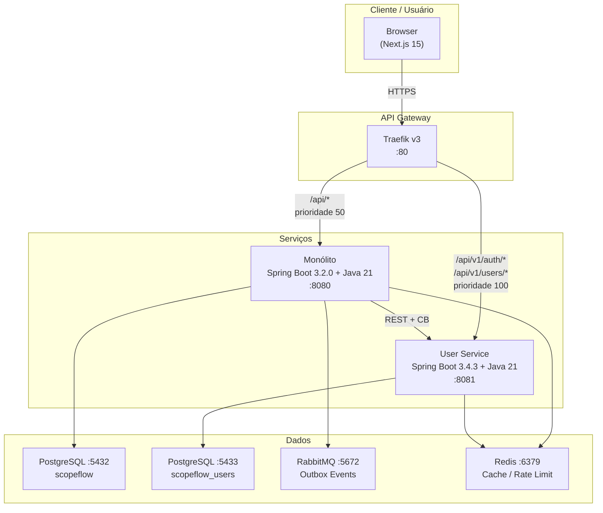
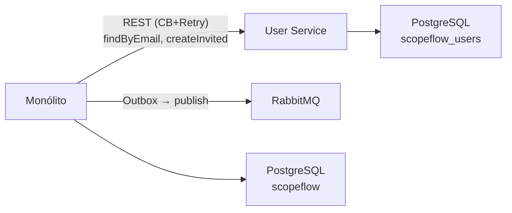
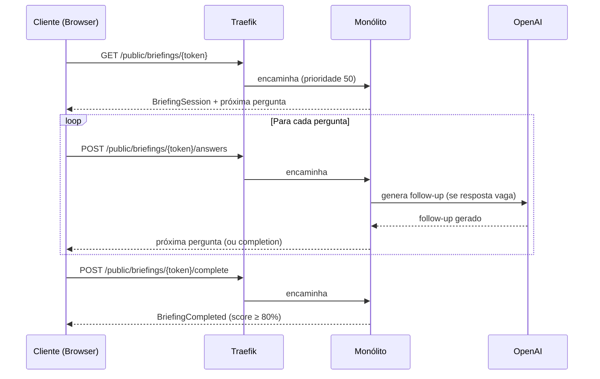
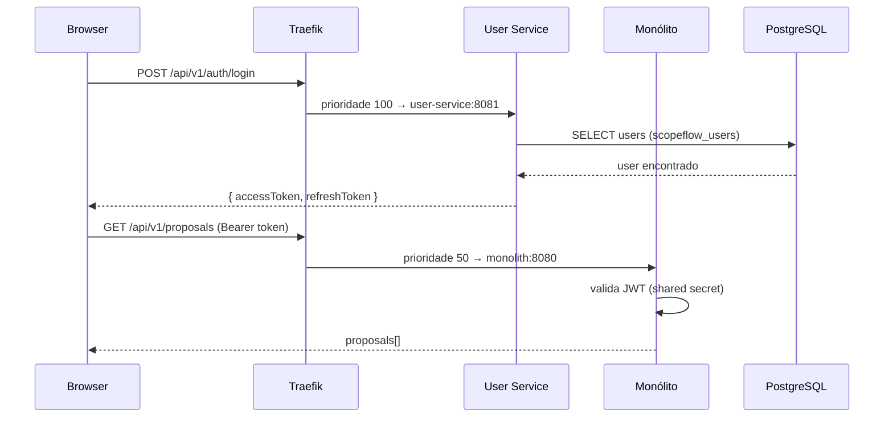
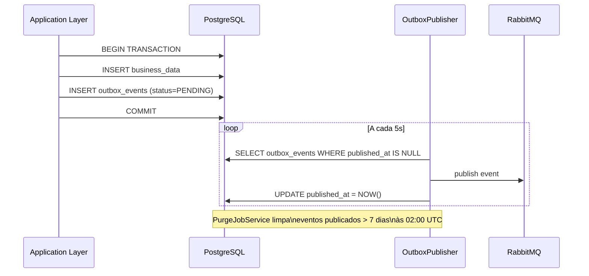

# ScopeFlow AI

> **Hub central de documentação.** Cada seção aponta para a fonte canônica — nunca duplicamos, sempre referenciamos.

AI-powered SaaS B2B que transforma conversas comerciais confusas em escopos claros, aprovados e prontos para execução — guiando prestadores de serviço (freelancers, microagências) por um processo estruturado de discovery com IA.

**Branch ativa:** `develop` | **Atualizado:** 2026-04-13 | **Status:** User Service em staging ✅

---

## Índice

1. [Visão Geral](#1-visão-geral)
2. [Arquitetura](#2-arquitetura)
3. [Mapa do Sistema](#3-mapa-do-sistema)
4. [Estrutura de Diretórios](#4-estrutura-de-diretórios)
5. [Gateway de Documentação](#5-gateway-de-documentação)
6. [Padrões e Convenções](#6-padrões-e-convenções)
7. [Padrão de Documentação](#7-padrão-de-documentação)
8. [Fluxos Principais](#8-fluxos-principais)
9. [Onboarding Rápido](#9-onboarding-rápido)
10. [Times e Responsabilidades](#10-times-e-responsabilidades)

---

## 1. Visão Geral

### O Problema

Pequenos prestadores de serviço B2B perdem contratos por escopo mal definido. Reuniões de discovery são longas, subjetivas e resultam em propostas imprecisas — gerando retrabalho, conflitos e margens erodidas.

### A Solução

ScopeFlow AI guia o cliente por um briefing estruturado via IA, detecta lacunas automaticamente, consolida respostas e gera propostas com escopo claro para aprovação digital.

### Capacidades Principais

| Capacidade | Descrição |
|-----------|-----------|
| **AI-Assisted Discovery** | Perguntas dinâmicas, gap detection, follow-ups automáticos |
| **Multi-tenant Workspace** | Isolamento por workspace (OWNER / ADMIN / MEMBER) |
| **Briefing Flow** | Sessão sequencial → score 80%+ → completion → proposta |
| **Client Public Access** | Cliente responde via token público (sem cadastro) |
| **Approval Workflow** | Proposta → publicada → aprovada/rejeitada pelo cliente |
| **Audit Trail imutável** | Todas as respostas e gerações de IA registradas |
| **Strangler Fig Migration** | Arquitetura preparada para extração incremental em microsserviços |

---

## 2. Arquitetura

### Visão de Alto Nível (C4 — Nível 2: Containers)



### Padrões Arquiteturais

| Padrão | Onde | Referência |
|--------|------|-----------|
| **Hexagonal (Ports & Adapters)** | Monólito e User Service | [docs/architecture/architectural-overview.md](docs/architecture/architectural-overview.md) |
| **Domain-Driven Design** | Todos os domínios | [docs/architecture/bounded-contexts.md](docs/architecture/bounded-contexts.md) |
| **Strangler Fig** | Extração incremental de microsserviços | [docs/migration/README.md](docs/migration/README.md) |
| **Outbox Pattern** | Eventos confiáveis → RabbitMQ | [CLAUDE.md § Outbox](CLAUDE.md) |
| **Idempotency Keys** | Endpoints públicos (sem auth) | [CLAUDE.md § Idempotency](CLAUDE.md) |
| **Circuit Breaker + Retry** | Chamadas ao User Service e SES | [CLAUDE.md § Circuit Breakers](CLAUDE.md) |
| **DB-per-service** | User Service: banco dedicado | [docs/migration/DB-MIGRATION-USER-SERVICE.md](docs/migration/DB-MIGRATION-USER-SERVICE.md) |
| **RFC 9457 Problem Details** | Todos os erros de API | [docs/architecture/adr/ADR-006-rfc9457-problem-details.md](docs/architecture/adr/ADR-006-rfc9457-problem-details.md) |

> Decisões arquiteturais completas em [docs/architecture/README.md](docs/architecture/README.md) (ADR-002 a ADR-009).

---

## 3. Mapa do Sistema

### Serviços

| Serviço | Tecnologia | Porta | Responsabilidade | Status |
|---------|-----------|-------|-----------------|--------|
| **Frontend** | Next.js 15 + React 19 | `:3000` | UI, auth flow, dashboard, proposals, briefings | ✅ Operacional |
| **Monólito** | Spring Boot 3.2.0 + Java 21 | `:8080` | Briefing, Proposal, Workspace, IA | ✅ Operacional |
| **User Service** | Spring Boot 3.4.3 + Java 21 | `:8081` | Auth, registro, perfil de usuário | ✅ Staging ativo |
| **Traefik** | v3.0 | `:80 / :8888` | API Gateway, roteamento Strangler Fig | ✅ Operacional |
| **PostgreSQL (monólito)** | v16 | `:5432` | `scopeflow` — todos os domínios do monólito | ✅ Operacional |
| **PostgreSQL (user-service)** | v16 | `:5433` | `scopeflow_users` — DB-per-service | ✅ Staging ativo |
| **RabbitMQ** | v3.13 | `:5672 / :15672` | Mensageria assíncrona (Outbox Pattern) | ✅ Operacional |
| **Redis** | v7 | `:6379` | Cache, rate limiting, sessões | ✅ Operacional |

### Domínios do Monólito

| Domínio | Agregado raiz | Tabelas | Status no Monólito | Extração |
|---------|--------------|---------|-------------------|---------|
| **Briefing** | `BriefingSession` | 7 | ✅ Completo | ⏳ Card 04 |
| **Proposal** | `Proposal` | 4 | ✅ Completo | ⏳ Card 03 |
| **Workspace** | `Workspace` | 2 | ✅ Completo | 🔄 Card 02 — próxima |
| **User** | — | — | ✅ Decommissioned | ✅ Card 01 extraído |

> **Nota:** `Client` não é um bounded context separado. É referenciado como `ClientId` (value object) no domínio Briefing e como `client_id` UUID em Proposal — candidato a contexto futuro.

### Relações entre Serviços



> Matriz de acoplamento detalhada: [docs/architecture/coupling-matrix.md](docs/architecture/coupling-matrix.md)

---

## 4. Estrutura de Diretórios

```
projeto-service-b2b/
│
├── README.md                        ← você está aqui (hub central)
├── CLAUDE.md                        ← guia para Claude Code
├── docker-compose.yml               ← stack completa (7 serviços)
├── docker-compose.staging.yml       ← override: DB-per-service
├── .env.example                     ← variáveis de ambiente documentadas
│
├── backend/                         ← Monólito Spring Boot 3.2.0 + Java 21
│   └── src/main/java/com/scopeflow/
│       ├── core/domain/             ← domínio puro (zero Spring/JPA)
│       ├── application/             ← use cases, outbox, idempotency, purge
│       ├── adapter/in/web/          ← REST controllers
│       ├── adapter/out/             ← persistence, email, pdf, userservice
│       └── config/                  ← Spring, Security, Resilience4j
│
├── user-service/                    ← Microsserviço extraído (Strangler Fig)
│   ├── src/main/java/com/scopeflow/user/
│   │   ├── domain/                  ← User aggregate (Email, PasswordHash)
│   │   ├── application/             ← use cases de auth e perfil
│   │   ├── adapter/                 ← AuthController, JpaUserRepository
│   │   └── config/                  ← Security, JWT, CORS
│   └── (sem docs — todos em docs/migration/ e docs/qa/)
│
├── frontend/                        ← Next.js 15 + React 19 + TypeScript
│   ├── AGENTS.md                    ← guia para AI agents (estrutura, comandos)
│   ├── GEMINI.md                    ← guia para Gemini CLI
│   ├── src/app/
│   │   ├── (auth)/                  ← login, register
│   │   └── dashboard/               ← dashboard, proposals, briefings
│   ├── src/stores/                  ← Zustand: session, dashboard, briefing
│   ├── src/lib/                     ← proposalApi, briefingApi, api.ts (axios)
│   ├── src/hooks/                   ← useToast
│   └── src/components/              ← dashboard/, ui/, briefing/
│
├── docs/                            ← Documentação técnica centralizada
│   ├── README.md                    ← índice de docs (ver §5 abaixo)
│   ├── PROJECT-STATUS.md            ← estado atual + backlog
│   ├── architecture/                ← ADRs, bounded contexts, security model
│   ├── migration/                   ← Strangler Fig: cards, ADRs, status
│   ├── database/                    ← schema, flyway, índices
│   ├── api/                         ← OpenAPI specs e guias de API
│   ├── qa/                          ← contract tests, cobertura
│   ├── deployment/                  ← guias de deploy
│   ├── devops/                      ← monitoring, SEO audit
│   ├── testing/                     ← smoke tests, integration guides
│   └── sessions/archive/            ← histórico de sessões
│
├── tests/e2e/                       ← E2E e smoke tests (Bash)
├── scripts/                         ← utilitários operacionais
├── infra/helm/                      ← Helm charts (Kubernetes)
└── k8s/helm/                        ← configs K8s adicionais
```

---

## 5. Gateway de Documentação

### Status do Projeto

| Documento | Descrição |
|-----------|-----------|
| [docs/PROJECT-STATUS.md](docs/PROJECT-STATUS.md) | ✅ Concluído · 🔄 Em progresso · ⏳ Backlog |

### Arquitetura e Decisões

| Documento | Descrição |
|-----------|-----------|
| [docs/architecture/README.md](docs/architecture/README.md) | Índice de arquitetura + pontos de atenção atualizados |
| [docs/architecture/architectural-overview.md](docs/architecture/architectural-overview.md) | C4 model, hexagonal, fluxos de dados |
| [docs/architecture/bounded-contexts.md](docs/architecture/bounded-contexts.md) | Aggregates, entities, value objects, eventos por contexto |
| [docs/architecture/coupling-matrix.md](docs/architecture/coupling-matrix.md) | Matriz de acoplamento entre bounded contexts |
| [docs/architecture/dependency-matrix.md](docs/architecture/dependency-matrix.md) | Dependências sync/async/data entre módulos |
| [docs/architecture/security-model.md](docs/architecture/security-model.md) | Auth, authz, multi-tenancy, PII, LGPD |
| [docs/architecture/data-ownership.md](docs/architecture/data-ownership.md) | Ownership de tabelas por contexto |
| [docs/architecture/schema-inventory.md](docs/architecture/schema-inventory.md) | Inventário completo: 17 tabelas, colunas, índices, FKs |
| [CLAUDE.md](CLAUDE.md) | Guia completo para Claude Code: padrões, known issues, backlog técnico |

#### ADRs — Arquitetura do Sistema

| ADR | Decisão |
|-----|---------|
| [ADR-002](docs/architecture/adr/ADR-002-briefing-domain.md) | Briefing domain design (sealed classes) |
| [ADR-003](docs/architecture/adr/ADR-003-sealed-domain-separate-jpa.md) | Sealed classes + JPA em camadas separadas |
| [ADR-004](docs/architecture/adr/ADR-004-records-for-dtos.md) | Records Java 21 para DTOs |
| [ADR-005](docs/architecture/adr/ADR-005-lazy-loading-default.md) | Lazy loading como default JPA |
| [ADR-006](docs/architecture/adr/ADR-006-rfc9457-problem-details.md) | RFC 9457 Problem Details para erros |
| [ADR-007](docs/architecture/adr/ADR-007-landing-dashboard-architecture.md) | Arquitetura landing + dashboard frontend |
| [ADR-008](docs/architecture/adr/ADR-008-user-service-extraction-complete.md) | User service extraction — conclusão |
| [ADR-009](docs/architecture/adr/ADR-009-user-module-decommission.md) | Decommission do módulo User no monólito |

### Migração (Strangler Fig)

| Documento | Descrição |
|-----------|-----------|
| [docs/migration/README.md](docs/migration/README.md) | Status geral + roadmap de extração |
| [docs/migration/EXTRACAO-USER-SERVICE-RESUMO.md](docs/migration/EXTRACAO-USER-SERVICE-RESUMO.md) | Resumo executivo da extração (20/20 sprints) |
| [docs/migration/extraction-cards/01-user-auth.md](docs/migration/extraction-cards/01-user-auth.md) | Card 01: User Auth ✅ Extraído |
| [docs/migration/extraction-cards/02-workspace.md](docs/migration/extraction-cards/02-workspace.md) | Card 02: Workspace 🔄 Próximo |
| [docs/migration/extraction-cards/03-proposal.md](docs/migration/extraction-cards/03-proposal.md) | Card 03: Proposal ⏳ Backlog |
| [docs/migration/extraction-cards/04-briefing.md](docs/migration/extraction-cards/04-briefing.md) | Card 04: Briefing ⏳ Backlog |
| [docs/migration/DB-MIGRATION-USER-SERVICE.md](docs/migration/DB-MIGRATION-USER-SERVICE.md) | Cut-over produção: pg_dump, restore, rollback |

#### ADRs — Migração

| ADR | Decisão |
|-----|---------|
| [ADR-001](docs/migration/adr/ADR-001-ordem-de-extracao-bounded-contexts.md) | Ordem de extração: User → Workspace → Proposal → Briefing |
| [ADR-002](docs/migration/adr/ADR-002-database-strategy-shared-inicial.md) | DB strategy: shared inicial → DB-per-service |
| [ADR-003](docs/migration/adr/ADR-003-comunicacao-entre-servicos.md) | Comunicação: REST síncrono + Outbox assíncrono |
| [ADR-004](docs/migration/adr/ADR-004-ownership-service-context.md) | Ownership de service_context tables |

### APIs

| Documento | Descrição |
|-----------|-----------|
| [docs/api/BRIEFING-API-GUIDE.md](docs/api/BRIEFING-API-GUIDE.md) | API do Briefing — 11 endpoints com exemplos |
| `http://localhost:8080/swagger-ui.html` | Swagger UI (monólito — requer app rodando) |
| `http://localhost:8081/swagger-ui.html` | Swagger UI (user-service — requer app rodando) |

### Banco de Dados

| Documento | Descrição |
|-----------|-----------|
| [docs/database/schema-diagram.md](docs/database/schema-diagram.md) | Diagrama ER — schema V4 (17 tabelas) |
| [docs/database/flyway-changelog.md](docs/database/flyway-changelog.md) | Histórico de migrations (V1–V9) |
| [docs/database/index-strategy.md](docs/database/index-strategy.md) | Estratégia de índices e performance |
| [docs/database/query-performance-baseline.md](docs/database/query-performance-baseline.md) | Baseline de queries críticas |

### QA e Testes

| Documento | Descrição |
|-----------|-----------|
| [docs/qa/contracts/README.md](docs/qa/contracts/README.md) | Índice de contract tests (Pact) |
| [docs/qa/contracts/CONTRACT-TESTING-GUIDE.md](docs/qa/contracts/CONTRACT-TESTING-GUIDE.md) | Guia de contract testing |
| [docs/qa/CONTRACT-TESTING-SUMMARY.md](docs/qa/CONTRACT-TESTING-SUMMARY.md) | Resumo dos contratos implementados |
| [docs/qa/CONTRACT-TESTS-MONOLITH.md](docs/qa/CONTRACT-TESTS-MONOLITH.md) | Contract tests do monólito (consumer) |
| [docs/qa/CONTRACT-TESTS-USER-SERVICE.md](docs/qa/CONTRACT-TESTS-USER-SERVICE.md) | Contract tests do user-service (provider) |
| [docs/qa/test-coverage-report.md](docs/qa/test-coverage-report.md) | Relatório de cobertura de testes |
| [tests/e2e/README.md](tests/e2e/README.md) | E2E: auth flow, smoke tests |
| [tests/e2e/TESTING-STRATEGY.md](tests/e2e/TESTING-STRATEGY.md) | Estratégia de testes E2E |

### DevOps e Deploy

| Documento | Descrição |
|-----------|-----------|
| [docs/deployment/DEPLOYMENT-GUIDE.md](docs/deployment/DEPLOYMENT-GUIDE.md) | Deploy em staging — passo a passo |
| [docs/devops/MONITOR-AND-HEAL-VALIDATION.md](docs/devops/MONITOR-AND-HEAL-VALIDATION.md) | Validação do script monitor-and-heal |
| [infra/helm/scopeflow-briefing/README.md](infra/helm/scopeflow-briefing/README.md) | Helm chart para Kubernetes |

### Frontend

| Documento | Descrição |
|-----------|-----------|
| [frontend/AGENTS.md](frontend/AGENTS.md) | Guidelines para AI agents (estrutura, comandos, convenções) |
| [frontend/GEMINI.md](frontend/GEMINI.md) | Guia mestre para Gemini CLI atuar no frontend |
| [docs/frontend/DASHBOARD-GUIDE.md](docs/frontend/DASHBOARD-GUIDE.md) | Componentes do dashboard, Zustand store, integração API |
| [docs/frontend/LANDING-PAGE-GUIDE.md](docs/frontend/LANDING-PAGE-GUIDE.md) | Landing page: SEO, SSG, customização, componentes |
| [docs/frontend/LANDING-ARCHITECTURE.md](docs/frontend/LANDING-ARCHITECTURE.md) | Arquitetura dos componentes da landing (props, data flow) |

---

## 6. Padrões e Convenções

### Código

| Aspecto | Padrão | Referência |
|---------|--------|-----------|
| **Estrutura** | Hexagonal: `domain → application → adapter.in/out → config` | [CLAUDE.md § Package Structure](CLAUDE.md) |
| **Domain objects** | Zero dependência Spring/JPA; sealed classes para estados; records para VOs | [ADR-003](docs/architecture/adr/ADR-003-sealed-domain-separate-jpa.md) |
| **DTOs** | Records Java 21: `{Entity}Request`, `{Entity}Response` | [ADR-004](docs/architecture/adr/ADR-004-records-for-dtos.md) |
| **Exceptions** | `{Domain}-{NNN}` (ex: `BRIEFING-001`) — herdadas de base domain exception | [CLAUDE.md § Domain Exceptions](CLAUDE.md) |
| **Erros de API** | RFC 9457 Problem Details em todos os endpoints | [ADR-006](docs/architecture/adr/ADR-006-rfc9457-problem-details.md) |
| **Queries** | Sempre filtradas por `workspace_id` — multi-tenancy obrigatório | [CLAUDE.md § Multi-Tenancy](CLAUDE.md) |
| **Testes** | `should{Behavior}_when{Condition}()` — Given/When/Then — Testcontainers (nunca H2) | [CLAUDE.md § Testing Conventions](CLAUDE.md) |
| **Frontend** | 2 spaces, single quotes, semicolons, `const` over `let` | [CLAUDE.md § JavaScript/TypeScript](CLAUDE.md) |

### Commits — Conventional Commits

```
type(scope): descrição breve em PT-BR (máx 70 chars, imperativo)

Corpo opcional explicando o porquê (72 chars/linha).

Closes #issue
```

| Tipo | Uso |
|------|-----|
| `feat` | Nova feature |
| `fix` | Correção de bug |
| `docs` | Documentação |
| `refactor` | Refatoração sem mudança de comportamento |
| `test` | Adição ou correção de testes |
| `chore` | Manutenção, dependências, configurações |
| `ci` | CI/CD pipelines |
| `perf` | Melhoria de performance |

### Branching

| Branch | Propósito | Proteções |
|--------|-----------|-----------|
| `main` | Produção — sempre deployável | PR obrigatório, CI deve passar |
| `develop` | Staging — integração de features | Branch ativa atual |
| `feature/{nome}` | Nova feature | — |
| `bugfix/{nome}` | Correção de bug | — |
| `hotfix/{nome}` | Correção urgente em produção | — |

---

## 7. Padrão de Documentação

### Quando criar cada tipo

| Tipo | Quando usar | Onde salvar |
|------|------------|-------------|
| **ADR** (Architecture Decision Record) | Decisão técnica relevante, irreversível ou com trade-offs significativos | `docs/architecture/adr/` ou `docs/migration/adr/` |
| **RFC** (Request for Comments) | Proposta que precisa de revisão antes de decidir | `docs/architecture/rfc/` (criar quando necessário) |
| **Extraction Card** | Plano detalhado de extração de um bounded context | `docs/migration/extraction-cards/` |
| **Guia técnico** | How-to, procedimentos operacionais | `docs/{categoria}/` |
| **Plano de sessão** | Planejamento de execução (aprovado pelo time) | `.claude/plans/` |

### Template ADR

```markdown
# ADR-{NNN}: {Título}

**Data:** YYYY-MM-DD
**Status:** Proposed | Accepted | Deprecated | Superseded by ADR-{NNN}
**Decisores:** [nomes ou times]

## Contexto

[Descreva o problema ou situação que gerou a necessidade desta decisão]

## Decisão

[A decisão tomada, de forma clara e afirmativa]

## Consequências

### Positivas
- [benefício 1]

### Negativas / Trade-offs
- [custo ou risco 1]

## Alternativas Consideradas

| Alternativa | Razão para não escolher |
|-------------|------------------------|
| Opção A | [motivo] |
```

### Template RFC

```markdown
# RFC-{NNN}: {Título}

**Data:** YYYY-MM-DD
**Autor:** [nome]
**Status:** Draft | In Review | Accepted | Rejected
**Prazo para comentários:** YYYY-MM-DD

## Sumário

[Uma frase descrevendo a proposta]

## Motivação

[Por que precisamos disso?]

## Proposta Detalhada

[Como implementar — código, diagramas, exemplos]

## Impacto e Riscos

[O que pode dar errado? Quanto esforço?]

## Alternativas

[O que mais foi considerado e por quê foi descartado]
```

### Template Guia Técnico

```markdown
# {Título}

**Última atualização:** YYYY-MM-DD
**Contexto:** [serviço ou domínio relacionado]

## Objetivo

[Uma frase — o que este guia ensina a fazer]

## Pré-requisitos

- [ ] item 1

## Passo a Passo

### 1. {Step}
[instrução + código/comando]

## Verificação

[Como confirmar que funcionou]

## Troubleshooting

| Problema | Causa | Solução |
|---------|-------|---------|
```

### Regras de Documentação

1. **Nunca duplicar** — se já existe em outro `.md`, referencie com link relativo
2. **Datas absolutas** — sempre `YYYY-MM-DD`, nunca "ontem" ou "semana passada"
3. **Status explícito** — todo ADR/RFC/Card tem status visível no topo
4. **Arquivos históricos** → `docs/sessions/archive/` (não deletar — são rastreabilidade)
5. **Máximo de 1 nível de aninhamento** em listas (legibilidade em mobile e PDF)

---

## 8. Fluxos Principais

### Fluxo 1 — Briefing Discovery (Happy Path)



### Fluxo 2 — Auth via User Service (Strangler Fig)



### Fluxo 3 — Evento de Domínio via Outbox



---

## 9. Onboarding Rápido

### Pré-requisitos

| Ferramenta | Versão mínima | Verificar |
|-----------|--------------|-----------|
| Java (Temurin) | 21 | `java -version` |
| Maven | 3.8+ | `./mvnw -v` |
| Node.js | 20 LTS | `node -v` |
| Docker Desktop | 4.x | `docker -v` |
| Docker Compose | v2 | `docker compose version` |

### Setup em 5 Minutos

```bash
# 1. Clone e configure variáveis
git clone <repo> && cd projeto-service-b2b
cp .env.example .env
# Edite .env: defina JWT_SECRET (mín 32 chars) → openssl rand -hex 32
# OPENAI_API_KEY é opcional — serviço retorna mock local sem ele

# 2. Suba a stack completa
docker compose up -d

# 3. Aguarde os health checks (≈ 2 min no primeiro boot)
docker compose ps

# 4. Acesse
# Frontend:         http://localhost:3000
# API (via Traefik): http://localhost/api/v1/...
# Traefik dashboard: http://localhost:8888/dashboard/
# RabbitMQ:         http://localhost:15672  (guest/guest)
```

### Setup Staging (DB-per-service)

```bash
docker compose -f docker-compose.yml -f docker-compose.staging.yml up -d
# User Service → banco dedicado scopeflow_users (:5433)
# Ver: docs/migration/DB-MIGRATION-USER-SERVICE.md para cut-over em produção
```

### Desenvolvimento Local (sem Docker para os serviços Java)

```bash
# Infraestrutura apenas
docker compose up postgres user-db rabbitmq redis -d

# Monólito
cd backend && ./mvnw spring-boot:run      # http://localhost:8080/api/v1

# User Service
cd user-service && ./mvnw spring-boot:run # http://localhost:8081/api/v1

# Frontend
cd frontend && npm install && npm run dev  # http://localhost:3000
```

### Testes

```bash
# Monólito — unitários (sem Docker, < 30s)
cd backend && ./mvnw test

# Monólito — integração (Testcontainers, requer Docker, ≈ 3 min)
cd backend && ./mvnw verify

# User Service
cd user-service && ./mvnw verify

# Frontend
cd frontend && npm run test

# E2E — auth flow completo (requer stack rodando)
./run-e2e-tests.sh

# Briefing E2E
./RUN-BRIEFING-TESTS.sh
```

### Troubleshooting Rápido

| Sintoma | Causa provável | Solução |
|---------|---------------|---------|
| `user-service` crash: `missing table [users]` | Imagem sem migration V1 | `docker compose build user-service && docker compose up -d user-service` |
| JWT rejeitado cross-service | `JWT_SECRET` diferente entre serviços | Verificar `.env` — ambos usam o mesmo secret |
| Traefik não roteia `/auth` | Labels do container não aplicadas | `curl -s http://localhost:8888/api/http/routers` — verificar prioridades |
| Flyway checksum mismatch | Migration modificada após aplicação | Nunca editar migration existente — criar `V{n+1}` |
| Testcontainers falha | Docker sem memória | Docker Desktop → Resources → Memory ≥ 4GB |

> Troubleshooting completo: [CLAUDE.md § Troubleshooting](CLAUDE.md)

---

## 10. Times e Responsabilidades

### Ownership por Serviço

| Serviço / Domínio | Time | Ownership |
|------------------|------|-----------|
| **Monólito — Briefing** | Backend | Domínio principal — IA, perguntas, scoring |
| **Monólito — Proposal** | Backend | Ciclo de vida da proposta, aprovação |
| **Monólito — Workspace** | Backend | Multi-tenancy, invite flow |
| **User Service** | Backend | Auth, JWT, perfil — microsserviço extraído |
| **Frontend** | Frontend | Next.js, Zustand, integração API |
| **Infra / Docker / CI** | DevOps | Docker Compose, GitHub Actions, Helm |
| **Database** | Backend + DBA | Flyway migrations, schema, índices |
| **Strangler Fig** | Tech Lead | Coordenação de extrações, ADRs de migração |

### Responsabilidades por Papel

| Papel | Responsabilidades |
|-------|-----------------|
| **Backend** | Implementar use cases, adapters, migrations, testes (Testcontainers), circuit breakers |
| **Frontend** | Componentes, Zustand stores, integração API, Vitest |
| **DevOps** | Docker Compose, GitHub Actions, Helm charts, monitoramento |
| **Tech Lead** | ADRs, extraction cards, decisões arquiteturais, code review |

### Documentar Decisões

Toda decisão arquitetural relevante gera um ADR em [`docs/architecture/adr/`](docs/architecture/adr/) ou [`docs/migration/adr/`](docs/migration/adr/). Usar o template em [§7](#7-padrão-de-documentação). Regra: se uma decisão vai gerar pergunta "por quê fizemos assim?" no futuro, ela merece um ADR.

---

## Métricas do Projeto

| Métrica | Valor |
|---------|-------|
| Linhas de código Java (monólito) | ~15.000 |
| Classes Java (user-service) | 40 |
| Testes — monólito | 62 arquivos (59 classes de teste + 3 fixtures/configs) |
| Testes — user-service | 7 |
| Suítes Vitest — frontend | 7 |
| Flyway migrations (monólito) | V1–V9 (9 aplicadas) |
| Flyway migrations (user-service) | V1 (1 aplicada) |
| ADRs documentados | 12 (8 arquitetura + 4 migração) |
| Extraction cards | 4 (1 extraído, 1 próxima, 2 backlog) |

---

<sub>Dúvidas sobre este documento? Ver [CLAUDE.md](CLAUDE.md) para contexto de implementação ou [docs/README.md](docs/README.md) para o índice completo de documentação.</sub>
