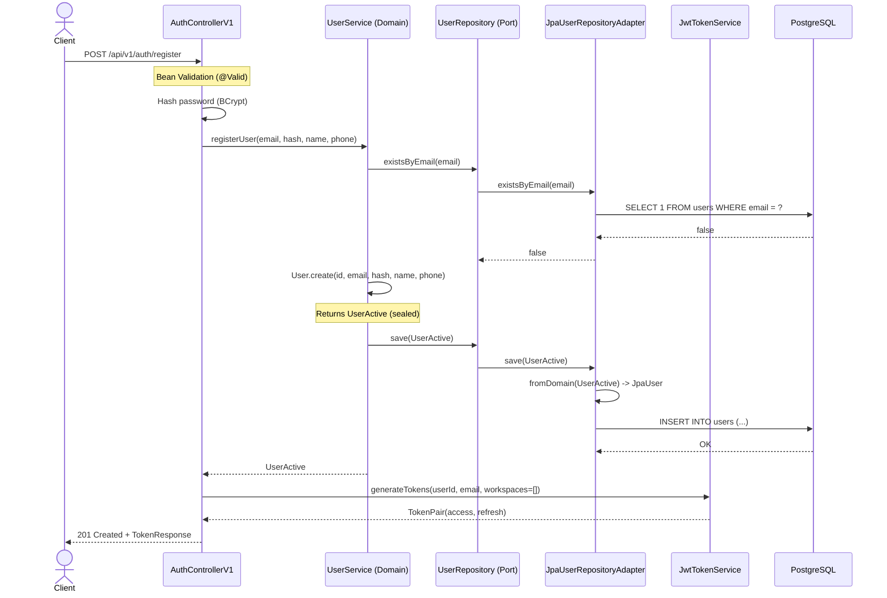
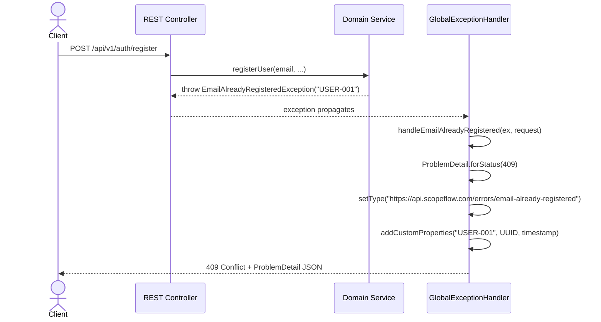

# Sprint 2: Adapter Layer Design Document

**Status:** Proposto
**Data:** 2026-03-24
**Autor:** Architect Agent
**Sprint:** 2 de 6 (MVP)
**Dependencia:** Sprint 1 (Domain Layer) - Concluida

---

## Sumario Executivo

Este documento especifica o design completo da camada de adaptadores (ports and adapters) do ScopeFlow AI. Cobre 3 bounded contexts: **User & Workspace**, **Briefing**, **Proposal**. O Briefing context ja possui implementacao parcial (Sprint 1b) que sera respeitada e estendida.

### Inventario do que ja existe (Sprint 1)

| Artefato | Status | Notas |
|----------|--------|-------|
| Domain model (3 contexts) | Completo | Sealed classes, records, value objects |
| Briefing JPA entities (5) | Completo | JpaBriefingSession, JpaBriefingAnswer, JpaBriefingQuestion, JpaAIGeneration, JpaBriefingActivityLog |
| Briefing repository adapters (4) | Completo | Com mapeamento domain <-> JPA |
| Briefing DTOs (10) | Completo | Records com Swagger annotations |
| BriefingControllerV1 | Completo | 8 endpoints autenticados |
| PublicBriefingControllerV1 | Completo | 3 endpoints publicos |
| GlobalExceptionHandler | Completo | RFC 9457, 12+ handlers |
| BriefingMapper | Completo | Domain <-> DTO conversao |
| Flyway migrations V1-V3 | Completo | Schema PostgreSQL |

### O que falta implementar nesta Sprint

| Artefato | Quantidade | Contexto |
|----------|-----------|----------|
| JPA entities novas | 10 | User/Workspace + Proposal |
| Repository adapters novos | 6 | User/Workspace + Proposal |
| REST controllers novos | 4 | Auth, Workspace, Proposal, Approval |
| DTOs novos | ~40 | Auth, Workspace, Proposal |
| Security config (JWT) | 1 | Spring Security 6.x |
| Flyway migration V4 | 1 | Proposal domain schema |
| ADRs | 4 | Decisoes arquiteturais |

---

## 1. JPA Entity Design

### 1.1 Convencoes

- **Naming:** `Jpa{DomainClass}` para evitar conflito com domain model
- **No setters:** Entidades imutaveis (construtor completo + protected no-arg para JPA)
- **@Version:** Optimistic locking em aggregates que sofrem updates concorrentes
- **Enums como String:** `@Enumerated(EnumType.STRING)` ou converter VARCHAR
- **JSONB:** `columnDefinition = "jsonb"` para campos estruturados
- **Timestamps:** `TIMESTAMP WITH TIME ZONE`, sempre UTC
- **Lazy by default:** Todos os `@OneToMany` e `@ManyToOne` sao LAZY
- **Converters bidirecionais:** `toDomain()` e `fromDomain()` no repository adapter

### 1.2 User & Workspace Context

#### JpaUser

```
Tabela: users (existente em V1/V2)
```

| Coluna | Tipo | Nullable | Constraints | Index |
|--------|------|----------|-------------|-------|
| id | UUID | N | PK | - |
| email | VARCHAR(255) | N | UNIQUE | idx_users_email |
| password_hash | VARCHAR(512) | N | - | - |
| full_name | VARCHAR(255) | N | - | - |
| phone | VARCHAR(20) | Y | - | - |
| status | VARCHAR(50) | N | CHECK (ACTIVE, INACTIVE, DELETED) | idx_users_status |
| created_at | TIMESTAMPTZ | N | DEFAULT NOW() | idx_users_created_at |
| updated_at | TIMESTAMPTZ | N | DEFAULT NOW() | - |

**Mapeamento domain:**
- `User (sealed)` -> status discrimina: ACTIVE -> `UserActive`, INACTIVE -> `UserInactive`, DELETED -> `UserDeleted`
- `Email` value object -> `email` VARCHAR
- `PasswordHash` value object -> `password_hash` VARCHAR
- `UserId` value object -> `id` UUID

**Converter (no adapter):**
```java
// JPA -> Domain
User toDomain(JpaUser jpa) {
    return switch (jpa.getStatus()) {
        case "ACTIVE" -> new UserActive(id, email, hash, name, phone, created, updated);
        case "INACTIVE" -> new UserInactive(id, email, hash, name, phone, created, updated);
        case "DELETED" -> new UserDeleted(id, email, hash, name, phone, created, updated);
        default -> throw new IllegalStateException("Unknown status: " + jpa.getStatus());
    };
}

// Domain -> JPA
JpaUser fromDomain(User user) {
    return new JpaUser(
        user.getId().value(),
        user.getEmail().value(),
        user.getPasswordHash().value(),
        user.getFullName(),
        user.getPhone(),
        user.status(),
        user.getCreatedAt(),
        user.getUpdatedAt()
    );
}
```

#### JpaWorkspace

```
Tabela: workspaces (existente em V2)
```

| Coluna | Tipo | Nullable | Constraints | Index |
|--------|------|----------|-------------|-------|
| id | UUID | N | PK | - |
| owner_id | UUID | N | FK -> users(id) ON DELETE RESTRICT | idx_workspaces_owner_id |
| name | VARCHAR(255) | N | - | - |
| niche | VARCHAR(100) | N | - | idx_workspaces_niche |
| tone_settings | JSONB | Y | - | - |
| status | VARCHAR(50) | N | CHECK (ACTIVE, SUSPENDED) | idx_workspaces_status |
| created_at | TIMESTAMPTZ | N | DEFAULT NOW() | idx_workspaces_created_at |
| updated_at | TIMESTAMPTZ | N | DEFAULT NOW() | - |
| version | BIGINT | N | DEFAULT 0 | - |

**@Version:** Sim. Workspaces podem ser atualizados concorrentemente (nome, tone, niche).

**Mapeamento domain:**
- `Workspace (sealed)` -> status discrimina: ACTIVE -> `WorkspaceActive`, SUSPENDED -> `WorkspaceSuspended`

#### JpaWorkspaceMember

```
Tabela: workspace_members (existente em V1/V2)
```

| Coluna | Tipo | Nullable | Constraints | Index |
|--------|------|----------|-------------|-------|
| id | UUID | N | PK | - |
| workspace_id | UUID | N | FK -> workspaces(id) ON DELETE CASCADE | idx_wm_workspace_id |
| user_id | UUID | N | FK -> users(id) ON DELETE CASCADE | idx_wm_user_id |
| role | VARCHAR(50) | N | CHECK (OWNER, ADMIN, MEMBER) | - |
| status | VARCHAR(50) | N | CHECK (ACTIVE, INVITED, LEFT) | - |
| invited_by | UUID | Y | FK -> users(id) ON DELETE SET NULL | - |
| invited_at | TIMESTAMPTZ | Y | - | - |
| accepted_at | TIMESTAMPTZ | Y | - | - |
| created_at | TIMESTAMPTZ | N | DEFAULT NOW() | - |
| updated_at | TIMESTAMPTZ | N | DEFAULT NOW() | - |

**Unique constraint:** `(workspace_id, user_id)` - um usuario por workspace.

**Mapeamento domain:**
- `WorkspaceMember (sealed)` -> status discrimina: ACTIVE -> `MemberActive`, INVITED -> `MemberInvited`, LEFT -> `MemberLeft`
- `Role enum` -> `role` VARCHAR (Spring Data JPA converte automaticamente)

#### JpaClient (NOVO)

```
Tabela: clients (existente em V1 como referencia)
```

| Coluna | Tipo | Nullable | Constraints | Index |
|--------|------|----------|-------------|-------|
| id | UUID | N | PK | - |
| workspace_id | UUID | N | FK -> workspaces(id) ON DELETE CASCADE | idx_clients_workspace_id |
| name | VARCHAR(255) | N | - | - |
| email | VARCHAR(255) | Y | - | - |
| phone | VARCHAR(20) | Y | - | - |
| company | VARCHAR(255) | Y | - | - |
| notes | TEXT | Y | - | - |
| created_at | TIMESTAMPTZ | N | DEFAULT NOW() | - |
| updated_at | TIMESTAMPTZ | N | DEFAULT NOW() | - |

**Nota:** Client nao tem domain class sealed (CRUD simples). JPA entity mapeia direto para DTOs via controller. Domain usa `ClientId` value object para referencia.

### 1.3 Briefing Context (JA IMPLEMENTADO)

Entidades existentes que nao precisam de alteracao:

- **JpaBriefingSession** - Mapeamento completo com toDomain/fromDomain
- **JpaBriefingQuestion** - Imutavel, audit trail
- **JpaBriefingAnswer** - Imutavel, audit trail
- **JpaAIGeneration** - Imutavel, audit trail
- **JpaBriefingActivityLog** - Imutavel, audit trail

### 1.4 Proposal Context (NOVO)

#### JpaProposal

```
Tabela: proposals (existente em V1)
```

| Coluna | Tipo | Nullable | Constraints | Index |
|--------|------|----------|-------------|-------|
| id | UUID | N | PK | - |
| workspace_id | UUID | N | FK -> workspaces(id) ON DELETE CASCADE | idx_proposals_workspace_id |
| client_id | UUID | N | FK -> clients(id) ON DELETE RESTRICT | idx_proposals_client_id |
| briefing_session_id | UUID | Y | FK -> briefing_sessions(id) ON DELETE SET NULL | idx_proposals_briefing_id |
| title | VARCHAR(500) | N | - | - |
| status | VARCHAR(50) | N | CHECK (DRAFT, PUBLISHED, APPROVED, REJECTED, EXPIRED) | idx_proposals_status |
| proposal_type | VARCHAR(50) | N | - | - |
| public_token | VARCHAR(128) | Y | UNIQUE | idx_proposals_public_token |
| created_by | UUID | N | FK -> users(id) ON DELETE SET NULL | - |
| created_at | TIMESTAMPTZ | N | DEFAULT NOW() | idx_proposals_created_at |
| updated_at | TIMESTAMPTZ | N | DEFAULT NOW() | - |
| version | BIGINT | N | DEFAULT 0 | - |

**@Version:** Sim. Proposals sofrem updates concorrentes (editar scope, publicar, aprovar).

**Indices compostos:**
- `(workspace_id, status)` - listagem por workspace filtrada por status
- `(workspace_id, client_id)` - listagem por cliente

#### JpaProposalVersion

```
Tabela: proposal_versions (existente em V1)
```

| Coluna | Tipo | Nullable | Constraints | Index |
|--------|------|----------|-------------|-------|
| id | UUID | N | PK | - |
| proposal_id | UUID | N | FK -> proposals(id) ON DELETE CASCADE | idx_pv_proposal_id |
| version_number | INTEGER | N | - | - |
| scope_json | JSONB | N | - | - |
| deliverables_json | JSONB | Y | - | - |
| exclusions_json | JSONB | Y | - | - |
| assumptions_json | JSONB | Y | - | - |
| price_amount | DECIMAL(15,2) | Y | - | - |
| price_currency | VARCHAR(3) | Y | DEFAULT 'BRL' | - |
| timeline_json | JSONB | Y | - | - |
| changed_by | UUID | Y | FK -> users(id) ON DELETE SET NULL | - |
| change_summary | TEXT | Y | - | - |
| created_at | TIMESTAMPTZ | N | DEFAULT NOW() | - |

**Imutavel:** Versoes nunca sao editadas apos criacao (audit trail).

**Unique constraint:** `(proposal_id, version_number)` - versao unica por proposta.

**Indices compostos:**
- `(proposal_id, version_number DESC)` - busca da versao mais recente

#### JpaProposalScope (embeddable ou JSONB)

**Decisao:** Usar JSONB dentro de `JpaProposalVersion.scope_json` em vez de tabela separada.

**Justificativa:** Scope e imutavel por versao (snapshot). JSONB permite schema evolution sem migration. Estrutura:

```json
{
  "deliverables": [
    {
      "name": "Posts semanais Instagram",
      "description": "3 posts/semana com criacao de arte e copy",
      "acceptanceCriteria": "Aprovacao do cliente antes da publicacao"
    }
  ],
  "exclusions": ["Gestao de trafego pago", "Producao de video"],
  "assumptions": ["Cliente fornece fotos de produto", "Aprovacao em ate 48h"],
  "price": {
    "amount": 2500.00,
    "currency": "BRL",
    "breakdown": [
      {"item": "Criacao de conteudo", "amount": 1500.00},
      {"item": "Gestao de comunidade", "amount": 1000.00}
    ]
  },
  "timeline": {
    "startDate": "2026-04-01",
    "endDate": "2026-06-30",
    "milestones": [
      {"name": "Kickoff", "dueDate": "2026-04-01"},
      {"name": "Primeira entrega", "dueDate": "2026-04-15"}
    ]
  }
}
```

#### JpaApprovalWorkflow

```
Tabela: approval_workflows (existente em V1)
```

| Coluna | Tipo | Nullable | Constraints | Index |
|--------|------|----------|-------------|-------|
| id | UUID | N | PK | - |
| proposal_id | UUID | N | FK -> proposals(id) ON DELETE CASCADE | idx_aw_proposal_id |
| proposal_version_id | UUID | N | FK -> proposal_versions(id) | - |
| status | VARCHAR(50) | N | CHECK (PENDING, APPROVED, REJECTED, EXPIRED) | idx_aw_status |
| required_approvers | INTEGER | N | DEFAULT 1 | - |
| current_approvals | INTEGER | N | DEFAULT 0 | - |
| expires_at | TIMESTAMPTZ | Y | - | - |
| created_at | TIMESTAMPTZ | N | DEFAULT NOW() | - |
| completed_at | TIMESTAMPTZ | Y | - | - |
| updated_at | TIMESTAMPTZ | N | DEFAULT NOW() | - |

#### JpaApproval

```
Tabela: approvals (existente em V1)
```

| Coluna | Tipo | Nullable | Constraints | Index |
|--------|------|----------|-------------|-------|
| id | UUID | N | PK | - |
| workflow_id | UUID | N | FK -> approval_workflows(id) ON DELETE CASCADE | idx_approvals_workflow_id |
| approver_name | VARCHAR(255) | N | - | - |
| approver_email | VARCHAR(255) | N | - | - |
| status | VARCHAR(50) | N | CHECK (PENDING, APPROVED, REJECTED) | idx_approvals_status |
| ip_address | VARCHAR(45) | Y | - | - |
| user_agent | TEXT | Y | - | - |
| comments | TEXT | Y | - | - |
| approved_at | TIMESTAMPTZ | Y | - | - |
| created_at | TIMESTAMPTZ | N | DEFAULT NOW() | - |

**Unique constraint:** `(workflow_id, approver_email)` - um voto por email por workflow.

**Nota de seguranca:** `ip_address` e `user_agent` sao capturados para audit trail (compliance LGPD). VARCHAR(45) cobre IPv6.

#### JpaProposalEvent

```
Tabela: proposal_events (NOVO - audit trail)
```

| Coluna | Tipo | Nullable | Constraints | Index |
|--------|------|----------|-------------|-------|
| id | UUID | N | PK | - |
| proposal_id | UUID | N | FK -> proposals(id) ON DELETE CASCADE | idx_pe_proposal_id |
| event_type | VARCHAR(50) | N | - | idx_pe_event_type |
| actor_id | UUID | Y | FK -> users(id) ON DELETE SET NULL | - |
| actor_email | VARCHAR(255) | Y | - | - |
| metadata_json | JSONB | Y | - | - |
| ip_address | VARCHAR(45) | Y | - | - |
| created_at | TIMESTAMPTZ | N | DEFAULT NOW() | idx_pe_created_at |

**Event types:** `CREATED`, `SCOPE_UPDATED`, `PUBLISHED`, `VIEWED`, `APPROVED`, `REJECTED`, `EXPIRED`, `KICKOFF_GENERATED`

#### JpaKickoffSummary

```
Tabela: kickoff_summaries (existente em V1)
```

| Coluna | Tipo | Nullable | Constraints | Index |
|--------|------|----------|-------------|-------|
| id | UUID | N | PK | - |
| proposal_id | UUID | N | FK -> proposals(id) ON DELETE CASCADE | idx_ks_proposal_id |
| content | TEXT | N | - | - |
| milestones_json | JSONB | Y | - | - |
| next_steps_json | JSONB | Y | - | - |
| stakeholders_json | JSONB | Y | - | - |
| generated_by_ai | BOOLEAN | N | DEFAULT FALSE | - |
| created_at | TIMESTAMPTZ | N | DEFAULT NOW() | - |
| updated_at | TIMESTAMPTZ | N | DEFAULT NOW() | - |

### 1.5 Resumo de Entidades JPA

| # | Entidade | Tabela | Context | Status |
|---|----------|--------|---------|--------|
| 1 | JpaUser | users | User & Workspace | **NOVO** |
| 2 | JpaWorkspace | workspaces | User & Workspace | **NOVO** |
| 3 | JpaWorkspaceMember | workspace_members | User & Workspace | **NOVO** |
| 4 | JpaClient | clients | User & Workspace | **NOVO** |
| 5 | JpaBriefingSession | briefing_sessions | Briefing | Existente |
| 6 | JpaBriefingQuestion | briefing_questions | Briefing | Existente |
| 7 | JpaBriefingAnswer | briefing_answers | Briefing | Existente |
| 8 | JpaAIGeneration | ai_generations | Briefing | Existente |
| 9 | JpaBriefingActivityLog | briefing_activity_logs | Briefing | Existente |
| 10 | JpaProposal | proposals | Proposal | **NOVO** |
| 11 | JpaProposalVersion | proposal_versions | Proposal | **NOVO** |
| 12 | JpaApprovalWorkflow | approval_workflows | Proposal | **NOVO** |
| 13 | JpaApproval | approvals | Proposal | **NOVO** |
| 14 | JpaProposalEvent | proposal_events | Proposal | **NOVO** |
| 15 | JpaKickoffSummary | kickoff_summaries | Proposal | **NOVO** |

**Total: 15 entidades (10 novas + 5 existentes)**

---

## 2. REST Endpoint Design

### 2.1 Convencoes de URL

- Base path: `/api/v1`
- Recursos no plural, kebab-case: `/briefings`, `/proposals`, `/workspace-members`
- IDs como path params: `/api/v1/proposals/{id}`
- Filtros como query params: `?status=DRAFT&page=0&size=20`
- Endpoints publicos (sem auth): prefixo `/api/v1/public/`
- Content-Type: `application/json`
- Error format: RFC 9457 Problem Details (`application/problem+json`)

### 2.2 Authentication Endpoints

| # | Method | Path | Auth | Roles | Description |
|---|--------|------|------|-------|-------------|
| 1 | POST | `/api/v1/auth/register` | No | - | Registrar novo usuario |
| 2 | POST | `/api/v1/auth/login` | No | - | Login com email/senha |
| 3 | POST | `/api/v1/auth/refresh` | No | - | Renovar access token |
| 4 | POST | `/api/v1/auth/logout` | Yes | ANY | Invalidar refresh token |
| 5 | GET | `/api/v1/auth/me` | Yes | ANY | Retornar usuario logado |

**Controller:** `AuthControllerV1`

#### POST /api/v1/auth/register

```
Request:  RegisterRequest(email, password, fullName, phone?)
Response: 201 Created -> TokenResponse(accessToken, refreshToken, expiresIn, user)
Errors:   409 -> EmailAlreadyRegisteredException (USER-001)
          400 -> MethodArgumentNotValidException (VALIDATION-400)
```

**Validacoes:**
- email: @NotBlank, @Email, max 255 chars
- password: @NotBlank, @Size(min=8, max=128), @Pattern(pelo menos 1 maiuscula, 1 numero)
- fullName: @NotBlank, @Size(min=2, max=255)
- phone: @Size(max=20), opcional

**Fluxo:**
1. Validar request (Bean Validation)
2. Hash password (BCryptPasswordEncoder)
3. Chamar UserService.registerUser()
4. Gerar JWT access + refresh token
5. Retornar TokenResponse

#### POST /api/v1/auth/login

```
Request:  LoginRequest(email, password)
Response: 200 OK -> TokenResponse(accessToken, refreshToken, expiresIn, user)
Errors:   401 -> InvalidCredentialsException (AUTH-001)
          404 -> UserNotFoundException (USER-002) [retorna como 401 por seguranca]
```

**Nota de seguranca:** Tanto email invalido quanto senha errada retornam 401 com mesma mensagem generica ("Invalid credentials"). Nao revelar se email existe.

#### POST /api/v1/auth/refresh

```
Request:  RefreshTokenRequest(refreshToken)
Response: 200 OK -> TokenResponse(accessToken, refreshToken, expiresIn, user)
Errors:   401 -> TokenExpiredException (AUTH-002)
          401 -> InvalidTokenException (AUTH-003)
```

#### POST /api/v1/auth/logout

```
Request:  (Authorization header com JWT)
Response: 204 No Content
Errors:   401 -> Unauthorized
```

**Implementacao:** Adicionar refresh token a blacklist (Redis com TTL = tempo restante do token).

#### GET /api/v1/auth/me

```
Request:  (Authorization header com JWT)
Response: 200 OK -> UserResponse(id, email, fullName, phone, status, createdAt)
Errors:   401 -> Unauthorized
```

### 2.3 Workspace Endpoints

| # | Method | Path | Auth | Roles | Description |
|---|--------|------|------|-------|-------------|
| 6 | POST | `/api/v1/workspaces` | Yes | ANY | Criar workspace |
| 7 | GET | `/api/v1/workspaces` | Yes | ANY | Listar workspaces do usuario |
| 8 | GET | `/api/v1/workspaces/{id}` | Yes | OWNER,ADMIN,MEMBER | Detalhe do workspace |
| 9 | PUT | `/api/v1/workspaces/{id}` | Yes | OWNER,ADMIN | Atualizar workspace |
| 10 | GET | `/api/v1/workspaces/{id}/members` | Yes | OWNER,ADMIN,MEMBER | Listar membros |
| 11 | POST | `/api/v1/workspaces/{id}/members/invite` | Yes | OWNER,ADMIN | Convidar membro |
| 12 | PUT | `/api/v1/workspaces/{id}/members/{memberId}/role` | Yes | OWNER | Alterar role |
| 13 | DELETE | `/api/v1/workspaces/{id}/members/{memberId}` | Yes | OWNER,ADMIN | Remover membro |

**Controller:** `WorkspaceControllerV1`

#### POST /api/v1/workspaces

```
Request:  CreateWorkspaceRequest(name, niche, toneSettings?)
Response: 201 Created -> WorkspaceResponse(id, name, niche, toneSettings, status, ownerEmail, createdAt)
Errors:   409 -> WorkspaceNameAlreadyExistsException (WORKSPACE-001)
          400 -> MethodArgumentNotValidException
```

**Validacoes:**
- name: @NotBlank, @Size(min=2, max=255)
- niche: @NotBlank, @Size(max=100)
- toneSettings: opcional, String JSON valido

**Fluxo:**
1. Extrair userId do JWT
2. Chamar WorkspaceService.createWorkspace()
3. Retornar WorkspaceResponse

#### GET /api/v1/workspaces

```
Request:  (Authorization header, query: ?page=0&size=20)
Response: 200 OK -> PageResponse<WorkspaceSummaryResponse>
```

Retorna apenas workspaces onde o usuario e membro.

#### PUT /api/v1/workspaces/{id}

```
Request:  UpdateWorkspaceRequest(name?, niche?, toneSettings?)
Response: 200 OK -> WorkspaceResponse
Errors:   404 -> WorkspaceNotFoundException (WORKSPACE-002)
          403 -> InsufficientPermissionException (AUTH-403)
          409 -> WorkspaceNameAlreadyExistsException (WORKSPACE-001)
```

#### POST /api/v1/workspaces/{id}/members/invite

```
Request:  InviteMemberRequest(email, role)
Response: 201 Created -> MemberResponse(id, email, fullName, role, status, invitedAt)
Errors:   409 -> MemberAlreadyExistsException (WORKSPACE-003)
          404 -> WorkspaceNotFoundException (WORKSPACE-002)
          404 -> UserNotFoundException (USER-002)
```

**Validacoes:**
- email: @NotBlank, @Email
- role: @NotNull, enum (ADMIN ou MEMBER; OWNER nao pode ser atribuido via invite)

#### PUT /api/v1/workspaces/{id}/members/{memberId}/role

```
Request:  UpdateRoleRequest(role)
Response: 200 OK -> MemberResponse
Errors:   409 -> CannotRemoveLastOwnerException (WORKSPACE-004)
          404 -> MemberNotFoundException (WORKSPACE-005)
```

#### DELETE /api/v1/workspaces/{id}/members/{memberId}

```
Request:  (path params only)
Response: 204 No Content
Errors:   409 -> CannotRemoveLastOwnerException (WORKSPACE-004)
          404 -> MemberNotFoundException (WORKSPACE-005)
```

### 2.4 Client Endpoints

| # | Method | Path | Auth | Roles | Description |
|---|--------|------|------|-------|-------------|
| 14 | POST | `/api/v1/workspaces/{wId}/clients` | Yes | OWNER,ADMIN | Criar cliente |
| 15 | GET | `/api/v1/workspaces/{wId}/clients` | Yes | ANY | Listar clientes |
| 16 | GET | `/api/v1/workspaces/{wId}/clients/{id}` | Yes | ANY | Detalhe do cliente |
| 17 | PUT | `/api/v1/workspaces/{wId}/clients/{id}` | Yes | OWNER,ADMIN | Atualizar cliente |
| 18 | DELETE | `/api/v1/workspaces/{wId}/clients/{id}` | Yes | OWNER,ADMIN | Remover cliente |

**Controller:** `ClientControllerV1`

Endpoints CRUD simples. Clients sao scoped por workspace (isolamento multi-tenant).

### 2.5 Briefing Endpoints (JA IMPLEMENTADOS)

Existentes no `BriefingControllerV1`:

| # | Method | Path | Auth | Description |
|---|--------|------|------|-------------|
| 19 | POST | `/api/v1/briefings` | Yes | Criar briefing session |
| 20 | GET | `/api/v1/briefings` | Yes | Listar briefings do workspace |
| 21 | GET | `/api/v1/briefings/{id}` | Yes | Detalhe do briefing |
| 22 | GET | `/api/v1/briefings/{id}/questions` | Yes | Listar perguntas |
| 23 | POST | `/api/v1/briefings/{id}/answers` | Yes | Submeter resposta |
| 24 | POST | `/api/v1/briefings/{id}/complete` | Yes | Completar briefing |
| 25 | POST | `/api/v1/briefings/{id}/abandon` | Yes | Abandonar briefing |
| 26 | GET | `/api/v1/briefings/{id}/progress` | Yes | Progresso do briefing |

Existentes no `PublicBriefingControllerV1`:

| # | Method | Path | Auth | Description |
|---|--------|------|------|-------------|
| 27 | GET | `/api/v1/public/briefings/{id}?token={token}` | No | Acesso publico ao briefing |
| 28 | POST | `/api/v1/public/briefings/{id}/answers?token={token}` | No | Submeter resposta (publico) |
| 29 | GET | `/api/v1/public/briefings/{id}/progress?token={token}` | No | Progresso (publico) |

### 2.6 Proposal Endpoints (NOVOS)

| # | Method | Path | Auth | Roles | Description |
|---|--------|------|------|-------|-------------|
| 30 | POST | `/api/v1/proposals` | Yes | OWNER,ADMIN | Criar proposta |
| 31 | GET | `/api/v1/proposals` | Yes | ANY | Listar propostas do workspace |
| 32 | GET | `/api/v1/proposals/{id}` | Yes | ANY | Detalhe da proposta |
| 33 | POST | `/api/v1/proposals/{id}/update-scope` | Yes | OWNER,ADMIN | Atualizar scope (nova versao) |
| 34 | POST | `/api/v1/proposals/{id}/publish` | Yes | OWNER,ADMIN | Publicar proposta |
| 35 | GET | `/api/v1/proposals/{id}/versions` | Yes | ANY | Listar versoes |
| 36 | GET | `/api/v1/proposals/{id}/versions/{versionNumber}` | Yes | ANY | Detalhe de versao especifica |

**Controller:** `ProposalControllerV1`

#### POST /api/v1/proposals

```
Request:  CreateProposalRequest(clientId, briefingSessionId?, title, proposalType, scope)
Response: 201 Created -> ProposalResponse
Errors:   404 -> ClientNotFoundException (CLIENT-001)
          404 -> BriefingNotFoundException (BRIEFING-001)
          422 -> BriefingNotCompletedException (BRIEFING-010)
          400 -> MethodArgumentNotValidException
```

**Validacoes:**
- clientId: @NotNull
- title: @NotBlank, @Size(min=5, max=500)
- proposalType: @NotBlank, @Size(max=50)
- scope: @NotNull, @Valid (nested validation)

**Fluxo:**
1. Validar request
2. Verificar client existe no workspace do usuario
3. Se briefingSessionId fornecido, verificar que esta COMPLETED
4. Criar Proposal (status=DRAFT) + ProposalVersion (version=1)
5. Criar ProposalEvent (type=CREATED)
6. Retornar ProposalResponse

#### POST /api/v1/proposals/{id}/update-scope

```
Request:  UpdateScopeRequest(scope, changeSummary?)
Response: 200 OK -> ProposalVersionResponse
Errors:   404 -> ProposalNotFoundException (PROPOSAL-001)
          409 -> ProposalNotEditableException (PROPOSAL-002) - se ja publicada/aprovada
```

**Fluxo:**
1. Verificar proposal existe e status=DRAFT
2. Criar nova ProposalVersion (version_number incrementado)
3. Criar ProposalEvent (type=SCOPE_UPDATED)
4. Retornar nova versao

#### POST /api/v1/proposals/{id}/publish

```
Request:  PublishProposalRequest(expiresIn?) - expiresIn em horas (default: 72h)
Response: 200 OK -> ProposalPublishedResponse(id, publicUrl, expiresAt)
Errors:   404 -> ProposalNotFoundException (PROPOSAL-001)
          409 -> ProposalAlreadyPublishedException (PROPOSAL-003)
          422 -> ProposalEmptyScopeException (PROPOSAL-004)
```

**Fluxo:**
1. Verificar proposal existe e status=DRAFT
2. Gerar public_token
3. Atualizar status para PUBLISHED
4. Criar ApprovalWorkflow (status=PENDING)
5. Criar ProposalEvent (type=PUBLISHED)
6. Retornar URL publica + expiresAt

### 2.7 Approval Endpoints (NOVOS)

| # | Method | Path | Auth | Roles | Description |
|---|--------|------|------|-------|-------------|
| 37 | POST | `/api/v1/proposals/{id}/initiate-approval` | Yes | OWNER,ADMIN | Iniciar workflow de aprovacao |
| 38 | GET | `/api/v1/public/proposals/{id}/approve` | No | - | Pagina de aprovacao (dados da proposta) |
| 39 | POST | `/api/v1/public/proposals/{id}/approve` | No | - | Submeter aprovacao |
| 40 | GET | `/api/v1/proposals/{id}/approvals` | Yes | ANY | Status das aprovacoes |

**Controllers:** `ApprovalControllerV1` (autenticado) + `PublicApprovalControllerV1` (publico)

#### GET /api/v1/public/proposals/{id}/approve?token={token}

```
Request:  query param token
Response: 200 OK -> PublicProposalResponse(title, scope, deliverables, exclusions, timeline, price)
Errors:   404 -> ProposalNotFoundException
          410 -> ProposalExpiredException (PROPOSAL-005) - token expirado
          400 -> InvalidTokenException (AUTH-003)
```

**Rate limit:** 10 req/min por IP (prevenir scraping).

#### POST /api/v1/public/proposals/{id}/approve?token={token}

```
Request:  ApproveProposalRequest(approverName, approverEmail)
Response: 201 Created -> ApprovalConfirmationResponse(approvalId, approvedAt, proposalTitle)
Errors:   404 -> ProposalNotFoundException
          410 -> ProposalExpiredException
          409 -> AlreadyApprovedException (PROPOSAL-006)
          400 -> InvalidTokenException
```

**Fluxo:**
1. Validar token + expiracao
2. Criar Approval (capturar IP, User-Agent)
3. Incrementar current_approvals no workflow
4. Se current_approvals >= required_approvers: atualizar workflow e proposal para APPROVED
5. Criar ProposalEvent (type=APPROVED)
6. Disparar async: gerar kickoff PDF, enviar email de confirmacao
7. Retornar confirmacao

### 2.8 Kickoff Endpoint (NOVO)

| # | Method | Path | Auth | Roles | Description |
|---|--------|------|------|-------|-------------|
| 41 | POST | `/api/v1/proposals/{id}/generate-kickoff` | Yes | OWNER,ADMIN | Gerar kickoff summary |
| 42 | GET | `/api/v1/proposals/{id}/kickoff` | Yes | ANY | Obter kickoff summary |

**Controller:** Dentro de `ProposalControllerV1`

#### POST /api/v1/proposals/{id}/generate-kickoff

```
Request:  (no body - usa dados da proposta aprovada)
Response: 201 Created -> KickoffResponse(id, summary, milestones, nextSteps)
Errors:   404 -> ProposalNotFoundException
          409 -> ProposalNotApprovedException (PROPOSAL-007) - precisa estar aprovada
          502 -> AIGenerationFailedException (AI-001) - falha no LLM
```

### 2.9 Resumo de Endpoints

| Contexto | Autenticados | Publicos | Total |
|----------|-------------|----------|-------|
| Authentication | 3 | 2 | 5 |
| Workspace | 8 | 0 | 8 |
| Client | 5 | 0 | 5 |
| Briefing | 8 | 3 | 11 (existente) |
| Proposal | 7 | 0 | 7 |
| Approval | 2 | 2 | 4 |
| Kickoff | 2 | 0 | 2 |
| **Total** | **35** | **7** | **42** |

---

## 3. DTO Design

### 3.1 Convencoes

- Todos os DTOs sao **records** (Java 21) - imutaveis, sem boilerplate
- Validacao via **Bean Validation** (Jakarta Validation)
- Documentacao via **@Schema** (Swagger/OpenAPI)
- Nomes: `{Action}{Entity}Request` para requests, `{Entity}Response` para responses
- Sem logica de negocio em DTOs - apenas estrutura e validacao
- `PageResponse<T>` generico para paginacao (ja existe)

### 3.2 Auth DTOs (6)

```java
// --- Requests ---

record RegisterRequest(
    @NotBlank @Email @Size(max=255) String email,
    @NotBlank @Size(min=8, max=128) String password,
    @NotBlank @Size(min=2, max=255) String fullName,
    @Size(max=20) String phone                          // opcional
)

record LoginRequest(
    @NotBlank @Email String email,
    @NotBlank String password
)

record RefreshTokenRequest(
    @NotBlank String refreshToken
)

// --- Responses ---

record TokenResponse(
    String accessToken,
    String refreshToken,
    long expiresIn,         // segundos ate expirar
    String tokenType,       // "Bearer"
    UserResponse user
)

record UserResponse(
    UUID id,
    String email,
    String fullName,
    String phone,
    String status,
    Instant createdAt
)

// ErrorResponse nao necessario: usamos ProblemDetail (RFC 9457) via GlobalExceptionHandler
```

### 3.3 Workspace DTOs (8)

```java
// --- Requests ---

record CreateWorkspaceRequest(
    @NotBlank @Size(min=2, max=255) String name,
    @NotBlank @Size(max=100) String niche,
    String toneSettings                                 // JSON string, opcional
)

record UpdateWorkspaceRequest(
    @Size(min=2, max=255) String name,                  // parcial update
    @Size(max=100) String niche,
    String toneSettings
)

record InviteMemberRequest(
    @NotBlank @Email String email,
    @NotNull Role role                                  // ADMIN ou MEMBER (nunca OWNER)
)

record UpdateRoleRequest(
    @NotNull Role role
)

// --- Responses ---

record WorkspaceResponse(
    UUID id,
    String name,
    String niche,
    String toneSettings,
    String status,
    UUID ownerId,
    Instant createdAt,
    Instant updatedAt
)

record WorkspaceSummaryResponse(
    UUID id,
    String name,
    String niche,
    String status,
    String role,            // role do usuario neste workspace
    int memberCount
)

record MemberResponse(
    UUID id,                // memberId (composto workspace+user)
    UUID userId,
    String email,
    String fullName,
    String role,
    String status,
    Instant joinedAt
)

record WorkspaceMembersResponse(
    UUID workspaceId,
    List<MemberResponse> members,
    int totalMembers
)
```

### 3.4 Client DTOs (4)

```java
record CreateClientRequest(
    @NotBlank @Size(max=255) String name,
    @Email @Size(max=255) String email,
    @Size(max=20) String phone,
    @Size(max=255) String company,
    String notes
)

record UpdateClientRequest(
    @Size(max=255) String name,
    @Email @Size(max=255) String email,
    @Size(max=20) String phone,
    @Size(max=255) String company,
    String notes
)

record ClientResponse(
    UUID id,
    String name,
    String email,
    String phone,
    String company,
    String notes,
    Instant createdAt,
    Instant updatedAt
)

record ClientSummaryResponse(
    UUID id,
    String name,
    String email,
    String company
)
```

### 3.5 Briefing DTOs (JA IMPLEMENTADOS - 10)

Existentes:
- `CreateBriefingRequest`
- `BriefingResponse`
- `BriefingDetailResponse`
- `PublicBriefingResponse`
- `QuestionResponse`
- `SubmitAnswerRequest`
- `AnswerResponse`
- `CompleteBriefingRequest`
- `AbandonBriefingRequest`
- `ProgressResponse`
- `PageResponse<T>`

### 3.6 Proposal DTOs (15)

```java
// --- Requests ---

record CreateProposalRequest(
    @NotNull UUID clientId,
    UUID briefingSessionId,                             // opcional
    @NotBlank @Size(min=5, max=500) String title,
    @NotBlank @Size(max=50) String proposalType,
    @NotNull @Valid ScopeRequest scope
)

record ScopeRequest(
    @NotEmpty List<@Valid DeliverableRequest> deliverables,
    List<String> exclusions,
    List<String> assumptions,
    @Valid PriceRequest price,
    @Valid TimelineRequest timeline
)

record DeliverableRequest(
    @NotBlank @Size(max=255) String name,
    @NotBlank @Size(max=2000) String description,
    @Size(max=1000) String acceptanceCriteria
)

record PriceRequest(
    @NotNull @DecimalMin("0") BigDecimal amount,
    @Size(min=3, max=3) String currency,                // default "BRL"
    List<@Valid PriceBreakdownRequest> breakdown
)

record PriceBreakdownRequest(
    @NotBlank String item,
    @NotNull @DecimalMin("0") BigDecimal amount
)

record TimelineRequest(
    @NotNull LocalDate startDate,
    @NotNull LocalDate endDate,
    List<@Valid MilestoneRequest> milestones
)

record MilestoneRequest(
    @NotBlank @Size(max=255) String name,
    @NotNull LocalDate dueDate,
    @Size(max=1000) String description
)

record UpdateScopeRequest(
    @NotNull @Valid ScopeRequest scope,
    @Size(max=1000) String changeSummary
)

record PublishProposalRequest(
    Integer expiresInHours                              // default 72
)

// --- Responses ---

record ProposalResponse(
    UUID id,
    UUID workspaceId,
    UUID clientId,
    String clientName,
    UUID briefingSessionId,
    String title,
    String status,
    String proposalType,
    int currentVersion,
    ScopeResponse latestScope,
    String publicUrl,                                   // null se nao publicada
    Instant createdAt,
    Instant updatedAt
)

record ProposalSummaryResponse(
    UUID id,
    String title,
    String clientName,
    String status,
    String proposalType,
    int currentVersion,
    Instant createdAt
)

record ProposalVersionResponse(
    UUID id,
    int versionNumber,
    ScopeResponse scope,
    String changedByName,
    String changeSummary,
    Instant createdAt
)

record ScopeResponse(
    List<DeliverableResponse> deliverables,
    List<String> exclusions,
    List<String> assumptions,
    PriceResponse price,
    TimelineResponse timeline
)

record DeliverableResponse(
    String name,
    String description,
    String acceptanceCriteria
)

record PriceResponse(
    BigDecimal amount,
    String currency,
    List<PriceBreakdownResponse> breakdown
)

record PriceBreakdownResponse(
    String item,
    BigDecimal amount
)

record TimelineResponse(
    LocalDate startDate,
    LocalDate endDate,
    List<MilestoneResponse> milestones
)

record MilestoneResponse(
    String name,
    LocalDate dueDate,
    String description
)

record ProposalPublishedResponse(
    UUID id,
    String publicUrl,
    String publicToken,
    Instant expiresAt
)
```

### 3.7 Approval DTOs (7)

```java
// --- Requests ---

record InitiateApprovalRequest(
    int requiredApprovers,                              // default 1
    Integer expiresInHours                              // default 72
)

record ApproveProposalRequest(
    @NotBlank @Size(max=255) String approverName,
    @NotBlank @Email @Size(max=255) String approverEmail,
    @Size(max=2000) String comments
)

// --- Responses ---

record ApprovalWorkflowResponse(
    UUID id,
    UUID proposalId,
    String status,
    int requiredApprovers,
    int currentApprovals,
    Instant expiresAt,
    List<ApprovalResponse> approvals,
    Instant createdAt,
    Instant completedAt
)

record ApprovalResponse(
    UUID id,
    String approverName,
    String approverEmail,
    String status,
    String comments,
    Instant approvedAt
)

record ApprovalConfirmationResponse(
    UUID approvalId,
    String proposalTitle,
    String status,
    Instant approvedAt,
    String message
)

record PublicProposalResponse(
    String title,
    String proposalType,
    ScopeResponse scope,
    String status,
    Instant publishedAt
)

// --- Kickoff ---

record KickoffResponse(
    UUID id,
    String content,
    List<MilestoneResponse> milestones,
    List<String> nextSteps,
    List<String> stakeholders,
    boolean generatedByAi,
    Instant createdAt
)
```

### 3.8 Resumo de DTOs

| Contexto | Request DTOs | Response DTOs | Total |
|----------|-------------|---------------|-------|
| Auth | 3 | 2 | 5 |
| Workspace | 4 | 4 | 8 |
| Client | 2 | 2 | 4 |
| Briefing | 4 (existente) | 7 (existente) | 11 (existente) |
| Proposal | 8 | 7 | 15 |
| Approval | 2 | 5 | 7 |
| **Total** | **23** | **27** | **50** |

---

## 4. Error Handling Design

### 4.1 Exception Hierarchy

```
RuntimeException
  +-- ScopeFlowException (abstract base)
  |   +-- ScopeFlowNotFoundException (abstract, 404)
  |   |   +-- UserNotFoundException (USER-002)
  |   |   +-- WorkspaceNotFoundException (WORKSPACE-002)
  |   |   +-- MemberNotFoundException (WORKSPACE-005)
  |   |   +-- ClientNotFoundException (CLIENT-001)
  |   |   +-- BriefingNotFoundException (BRIEFING-001) [existente]
  |   |   +-- ProposalNotFoundException (PROPOSAL-001)
  |   |
  |   +-- ScopeFlowConflictException (abstract, 409)
  |   |   +-- EmailAlreadyRegisteredException (USER-001) [existente]
  |   |   +-- WorkspaceNameAlreadyExistsException (WORKSPACE-001) [existente]
  |   |   +-- MemberAlreadyExistsException (WORKSPACE-003) [existente]
  |   |   +-- CannotRemoveLastOwnerException (WORKSPACE-004) [existente]
  |   |   +-- BriefingAlreadyInProgressException (BRIEFING-002) [existente]
  |   |   +-- BriefingAlreadyCompletedException (BRIEFING-003) [existente]
  |   |   +-- InvalidStateException (BRIEFING-004) [existente]
  |   |   +-- ProposalNotEditableException (PROPOSAL-002)
  |   |   +-- ProposalAlreadyPublishedException (PROPOSAL-003)
  |   |   +-- AlreadyApprovedException (PROPOSAL-006)
  |   |   +-- ProposalNotApprovedException (PROPOSAL-007)
  |   |
  |   +-- ScopeFlowValidationException (abstract, 400/422)
  |   |   +-- InvalidAnswerException (BRIEFING-005) [existente]
  |   |   +-- ProposalEmptyScopeException (PROPOSAL-004)
  |   |
  |   +-- ScopeFlowUnprocessableException (abstract, 422)
  |   |   +-- MaxFollowupExceededException (BRIEFING-006) [existente]
  |   |   +-- IncompleteGapsException (BRIEFING-007) [existente]
  |   |   +-- BriefingNotCompletedException (BRIEFING-010)
  |   |
  |   +-- ScopeFlowAuthException (abstract, 401)
  |   |   +-- InvalidCredentialsException (AUTH-001)
  |   |   +-- TokenExpiredException (AUTH-002)
  |   |   +-- InvalidTokenException (AUTH-003)
  |   |
  |   +-- ScopeFlowGoneException (abstract, 410)
  |   |   +-- ProposalExpiredException (PROPOSAL-005)
  |   |
  |   +-- ScopeFlowExternalException (abstract, 502)
  |       +-- AIGenerationFailedException (AI-001)
  |       +-- S3UploadFailedException (STORAGE-001)
  |
  +-- Spring exceptions (handled by GlobalExceptionHandler)
      +-- MethodArgumentNotValidException -> 400 (VALIDATION-400)
      +-- AccessDeniedException -> 403 (AUTH-403)
      +-- HttpRequestMethodNotSupportedException -> 405
```

### 4.2 Error Code Convention

Formato: `{DOMAIN}-{NNN}`

| Dominio | Range | Exemplos |
|---------|-------|----------|
| USER | 001-099 | USER-001 (email duplicado), USER-002 (nao encontrado) |
| AUTH | 001-099 | AUTH-001 (credenciais invalidas), AUTH-002 (token expirado), AUTH-403 (forbidden) |
| WORKSPACE | 001-099 | WORKSPACE-001 (nome duplicado), WORKSPACE-002 (nao encontrado) |
| CLIENT | 001-099 | CLIENT-001 (nao encontrado) |
| BRIEFING | 001-099 | BRIEFING-001 (nao encontrado), BRIEFING-010 (nao completado) |
| PROPOSAL | 001-099 | PROPOSAL-001 (nao encontrada), PROPOSAL-005 (expirada) |
| AI | 001-099 | AI-001 (geracao falhou) |
| STORAGE | 001-099 | STORAGE-001 (upload S3 falhou) |
| VALIDATION | 400 | VALIDATION-400 (bean validation) |
| RATE | 429 | RATE-429 (rate limit) |
| INTERNAL | 500 | INTERNAL-500 (catch-all) |

### 4.3 GlobalExceptionHandler (extensao)

O handler existente ja cobre excepcoes de Briefing e Workspace. Novos handlers necessarios:

```java
// 401 - Authentication
@ExceptionHandler(InvalidCredentialsException.class)     // AUTH-001
@ExceptionHandler(TokenExpiredException.class)           // AUTH-002
@ExceptionHandler(InvalidTokenException.class)           // AUTH-003

// 404 - Not Found
@ExceptionHandler(UserNotFoundException.class)           // USER-002
@ExceptionHandler(ClientNotFoundException.class)         // CLIENT-001
@ExceptionHandler(ProposalNotFoundException.class)       // PROPOSAL-001

// 409 - Conflict
@ExceptionHandler(ProposalNotEditableException.class)    // PROPOSAL-002
@ExceptionHandler(ProposalAlreadyPublishedException.class) // PROPOSAL-003
@ExceptionHandler(AlreadyApprovedException.class)        // PROPOSAL-006
@ExceptionHandler(ProposalNotApprovedException.class)    // PROPOSAL-007

// 410 - Gone
@ExceptionHandler(ProposalExpiredException.class)        // PROPOSAL-005

// 422 - Unprocessable
@ExceptionHandler(ProposalEmptyScopeException.class)     // PROPOSAL-004
@ExceptionHandler(BriefingNotCompletedException.class)   // BRIEFING-010

// 502 - Bad Gateway
@ExceptionHandler(AIGenerationFailedException.class)     // AI-001
@ExceptionHandler(S3UploadFailedException.class)         // STORAGE-001
```

### 4.4 Problem Detail Response Format

```json
{
  "type": "https://api.scopeflow.com/errors/proposal-not-found",
  "title": "Proposal Not Found",
  "status": 404,
  "detail": "Proposal with id '550e8400-...' not found in workspace '6ba7b810-...'",
  "instance": "/api/v1/proposals/550e8400-...",
  "error_code": "PROPOSAL-001",
  "error_id": "7c9e6679-7425-40de-944b-e07fc1f90ae7",
  "timestamp": "2026-03-24T10:30:45Z"
}
```

Para erros de validacao, campo extra `violations`:

```json
{
  "type": "https://api.scopeflow.com/errors/validation-error",
  "title": "Validation Error",
  "status": 400,
  "detail": "Request validation failed",
  "violations": [
    {"field": "email", "rejected_value": "invalid", "message": "must be a valid email"},
    {"field": "password", "rejected_value": "123", "message": "size must be between 8 and 128"}
  ],
  "error_code": "VALIDATION-400",
  "error_id": "...",
  "timestamp": "..."
}
```

---

## 5. Security Design

### 5.1 JWT Configuration

| Parametro | Valor | Justificativa |
|-----------|-------|---------------|
| Access token TTL | 15 minutos | Curto o suficiente para limitar janela de ataque |
| Refresh token TTL | 7 dias | Longo o suficiente para UX sem re-login diario |
| Algorithm | HS256 (HMAC-SHA256) | Simples, performante. RS256 se federacao necessaria |
| Secret | ENV var `JWT_SECRET` | 256-bit random, nunca hardcoded |
| Claims | sub (userId), email, workspaceIds[], roles{}, iat, exp | Payload minimo |

**JWT Payload:**

```json
{
  "sub": "550e8400-e29b-41d4-a716-446655440000",
  "email": "user@example.com",
  "workspaces": [
    {
      "id": "6ba7b810-9dad-11d1-80b4-00c04fd430c8",
      "role": "OWNER"
    }
  ],
  "iat": 1711267200,
  "exp": 1711268100
}
```

**Nota:** Incluir workspaces/roles no JWT evita lookup no banco a cada request. Trade-off: se role mudar, usuario precisa re-login ou refresh para atualizar claims. Aceitavel para MVP (roles mudam raramente).

### 5.2 Spring Security Configuration

```java
@Configuration
@EnableWebSecurity
@EnableMethodSecurity(prePostEnabled = true)
public class SecurityConfig {

    @Bean
    SecurityFilterChain filterChain(HttpSecurity http) {
        http
            .csrf(csrf -> csrf.disable())           // Stateless, nao precisa CSRF
            .cors(cors -> cors.configurationSource(corsConfigSource()))
            .sessionManagement(sm -> sm.sessionCreationPolicy(STATELESS))
            .authorizeHttpRequests(auth -> auth
                // Publicos
                .requestMatchers(POST, "/api/v1/auth/register").permitAll()
                .requestMatchers(POST, "/api/v1/auth/login").permitAll()
                .requestMatchers(POST, "/api/v1/auth/refresh").permitAll()
                .requestMatchers(GET, "/api/v1/public/**").permitAll()
                .requestMatchers(POST, "/api/v1/public/**").permitAll()
                .requestMatchers(GET, "/actuator/health").permitAll()
                // Tudo mais exige autenticacao
                .anyRequest().authenticated()
            )
            .addFilterBefore(jwtAuthFilter, UsernamePasswordAuthenticationFilter.class);
        return http.build();
    }
}
```

### 5.3 RBAC Authorization

| Endpoint Pattern | OWNER | ADMIN | MEMBER |
|-----------------|-------|-------|--------|
| POST /workspaces | ANY | ANY | ANY |
| PUT /workspaces/{id} | OK | OK | DENIED |
| DELETE /workspaces/{id} | OK | DENIED | DENIED |
| POST .../members/invite | OK | OK | DENIED |
| PUT .../members/{id}/role | OK | DENIED | DENIED |
| DELETE .../members/{id} | OK | OK* | DENIED |
| POST /proposals | OK | OK | DENIED |
| POST .../update-scope | OK | OK | DENIED |
| POST .../publish | OK | OK | DENIED |
| POST .../initiate-approval | OK | OK | DENIED |
| GET /proposals, /briefings | OK | OK | OK |
| POST .../generate-kickoff | OK | OK | DENIED |

*ADMIN pode remover MEMBER, mas nao OWNER ou outro ADMIN.

**Implementacao:** `@PreAuthorize` com custom SpEL expression:

```java
@PreAuthorize("@workspaceSecurity.hasRole(#workspaceId, 'OWNER', 'ADMIN')")
```

### 5.4 Workspace Isolation

Todo endpoint autenticado (exceto /auth/*) deve filtrar por workspace_id:

1. JWT contém lista de workspaces + roles
2. Header `X-Workspace-Id` ou path param indica workspace ativo
3. `WorkspaceSecurityFilter` valida que usuario e membro do workspace
4. Todas as queries JPA incluem `WHERE workspace_id = ?`
5. Se usuario nao pertence ao workspace: 403 Forbidden

### 5.5 Rate Limiting

| Endpoint | Limite | Escopo |
|----------|--------|--------|
| POST /auth/login | 5/min | por IP |
| POST /auth/register | 3/min | por IP |
| POST /auth/refresh | 10/min | por IP |
| GET /public/proposals/*/approve | 10/min | por IP |
| POST /public/proposals/*/approve | 3/min | por IP |
| POST /public/briefings/*/answers | 20/min | por IP |
| Endpoints autenticados | 100/min | por usuario |

**Implementacao:** Bucket4j com cache Redis (ou in-memory para MVP).

### 5.6 CORS

```java
CorsConfiguration config = new CorsConfiguration();
config.setAllowedOrigins(List.of(
    "http://localhost:3000",     // dev frontend
    "https://app.scopeflow.com" // production
));
config.setAllowedMethods(List.of("GET", "POST", "PUT", "DELETE", "OPTIONS"));
config.setAllowedHeaders(List.of("Authorization", "Content-Type", "X-Workspace-Id"));
config.setExposedHeaders(List.of("X-Total-Count", "X-Request-Id"));
config.setAllowCredentials(true);
config.setMaxAge(3600L);
```

---

## 6. Diagramas

### 6.1 Domain -> JPA Entity Mapping (User Context)

```
Domain Layer                          Adapter Layer (Persistence)
-----------                          ---------------------------

  User (sealed abstract)              JpaUser (@Entity)
    +-- UserActive      ----\         +-- id: UUID (PK)
    +-- UserInactive    -----+------> +-- email: VARCHAR
    +-- UserDeleted     ----/         +-- password_hash: VARCHAR
                                      +-- full_name: VARCHAR
  UserId (record)    -----> id        +-- phone: VARCHAR
  Email (record)     -----> email     +-- status: VARCHAR (discriminator)
  PasswordHash (record) --> password  +-- created_at: TIMESTAMPTZ
                                      +-- updated_at: TIMESTAMPTZ

  Converter: JpaUserRepositoryAdapter
    toDomain(JpaUser) -> switch(status) { ACTIVE -> UserActive, ... }
    fromDomain(User)  -> new JpaUser(id, email, hash, name, status, ...)
```

### 6.2 Request -> Domain -> Response Flow (/auth/register)



### 6.3 Exception Handling Flow



### 6.4 Context Diagram (C4 Level 1)

```
                    +------------------+
                    |   Frontend       |
                    |   (Next.js 15)   |
                    +--------+---------+
                             |
                     REST API (HTTPS)
                             |
                    +--------v---------+
                    |   ScopeFlow API  |
                    |  (Spring Boot)   |
                    |                  |
                    |  Auth | Workspace|
                    |  Briefing|Proposal|
                    +---+---------+----+
                        |         |
                +-------v--+  +---v--------+
                | PostgreSQL|  | OpenAI API |
                | (data)    |  | (LLM)     |
                +-----------+  +------------+

                +-- Redis (session/cache, futuro) --+
                +-- S3 (PDFs, logos, futuro) --------+
                +-- RabbitMQ (async jobs, futuro) ---+
```

### 6.5 Container Diagram (C4 Level 2 - Backend)

```
+----------------------------------------------------------------+
|                     ScopeFlow API (Spring Boot)                 |
|                                                                 |
|  +-- adapter/in/web/ --+  +-- adapter/out/persistence/ ------+ |
|  | AuthControllerV1    |  | JpaUserRepositoryAdapter          | |
|  | WorkspaceCtrlV1     |  | JpaWorkspaceRepositoryAdapter     | |
|  | ClientCtrlV1        |  | JpaWorkspaceMemberRepoAdapter     | |
|  | BriefingCtrlV1 (*)  |  | JpaBriefingRepositoryAdapter (*)  | |
|  | PublicBriefingV1 (*)|  | JpaBriefingAnswerRepoAdapter (*)  | |
|  | ProposalCtrlV1      |  | JpaBriefingQuestionRepoAdapter (*)||
|  | ApprovalCtrlV1      |  | JpaAIGenerationRepoAdapter (*)   | |
|  | PublicApprovalV1    |  | JpaProposalRepositoryAdapter      | |
|  | GlobalExcHandler (*)|  | JpaApprovalWorkflowRepoAdapter    | |
|  +---------------------+  +-----------------------------------+ |
|                                                                 |
|  +-- core/domain/ --------+  +-- config/ -------------------+  |
|  | user/ (sealed classes)  |  | SecurityConfig              |  |
|  | workspace/ (sealed)     |  | JwtTokenService             |  |
|  | briefing/ (sealed) (*)  |  | CorsConfig                  |  |
|  | proposal/ (a criar)     |  | JacksonConfig (JSONB)       |  |
|  | UserService             |  | FlywayConfig (migrations)   |  |
|  | WorkspaceService        |  | WebMvcConfig                |  |
|  | BriefingService (*)     |  +-----------------------------+  |
|  | ProposalService (a criar)|                                   |
|  +-------------------------+                                    |
|                                                                 |
|  (*) = ja implementado na Sprint 1                              |
+----------------------------------------------------------------+
```

---

## 7. Flyway Migration V4 (Proposal Domain)

Nova migration para estender o schema existente com suporte ao Proposal context:

```sql
-- V4__proposal_domain_schema.sql

-- Adicionar workspace_id e public_token em proposals (V1 usa project_id)
ALTER TABLE proposals
    ADD COLUMN IF NOT EXISTS workspace_id UUID,
    ADD COLUMN IF NOT EXISTS public_token VARCHAR(128),
    ADD COLUMN IF NOT EXISTS client_id UUID;

-- Adicionar tabela de proposal_events
CREATE TABLE IF NOT EXISTS proposal_events (
    id UUID PRIMARY KEY DEFAULT gen_random_uuid(),
    proposal_id UUID NOT NULL REFERENCES proposals(id) ON DELETE CASCADE,
    event_type VARCHAR(50) NOT NULL,
    actor_id UUID REFERENCES users(id) ON DELETE SET NULL,
    actor_email VARCHAR(255),
    metadata_json JSONB,
    ip_address VARCHAR(45),
    created_at TIMESTAMP WITH TIME ZONE NOT NULL DEFAULT CURRENT_TIMESTAMP
);

CREATE INDEX idx_proposal_events_proposal_id ON proposal_events(proposal_id);
CREATE INDEX idx_proposal_events_event_type ON proposal_events(event_type);
CREATE INDEX idx_proposal_events_created_at ON proposal_events(created_at);

-- Adicionar expires_at e proposal_version_id em approval_workflows
ALTER TABLE approval_workflows
    ADD COLUMN IF NOT EXISTS expires_at TIMESTAMP WITH TIME ZONE,
    ADD COLUMN IF NOT EXISTS proposal_version_id UUID;

-- Adicionar campos de client info em approvals (para aprovacao publica)
ALTER TABLE approvals
    ADD COLUMN IF NOT EXISTS approver_name VARCHAR(255),
    ADD COLUMN IF NOT EXISTS approver_email VARCHAR(255),
    ADD COLUMN IF NOT EXISTS ip_address VARCHAR(45),
    ADD COLUMN IF NOT EXISTS user_agent TEXT;

-- Adicionar scope detalhado em proposal_versions
ALTER TABLE proposal_versions
    ADD COLUMN IF NOT EXISTS scope_json JSONB,
    ADD COLUMN IF NOT EXISTS deliverables_json JSONB,
    ADD COLUMN IF NOT EXISTS exclusions_json JSONB,
    ADD COLUMN IF NOT EXISTS assumptions_json JSONB,
    ADD COLUMN IF NOT EXISTS price_amount DECIMAL(15,2),
    ADD COLUMN IF NOT EXISTS price_currency VARCHAR(3) DEFAULT 'BRL',
    ADD COLUMN IF NOT EXISTS timeline_json JSONB,
    ADD COLUMN IF NOT EXISTS change_summary TEXT;

-- Criar tabela clients (se nao existir)
CREATE TABLE IF NOT EXISTS clients (
    id UUID PRIMARY KEY DEFAULT gen_random_uuid(),
    workspace_id UUID NOT NULL REFERENCES workspaces(id) ON DELETE CASCADE,
    name VARCHAR(255) NOT NULL,
    email VARCHAR(255),
    phone VARCHAR(20),
    company VARCHAR(255),
    notes TEXT,
    created_at TIMESTAMP WITH TIME ZONE NOT NULL DEFAULT CURRENT_TIMESTAMP,
    updated_at TIMESTAMP WITH TIME ZONE NOT NULL DEFAULT CURRENT_TIMESTAMP
);

CREATE INDEX IF NOT EXISTS idx_clients_workspace_id ON clients(workspace_id);

-- Adicionar version column para optimistic locking
ALTER TABLE proposals ADD COLUMN IF NOT EXISTS version BIGINT NOT NULL DEFAULT 0;
ALTER TABLE workspaces ADD COLUMN IF NOT EXISTS version BIGINT NOT NULL DEFAULT 0;

-- Unique constraint para public_token de proposals
CREATE UNIQUE INDEX IF NOT EXISTS idx_proposals_public_token ON proposals(public_token)
    WHERE public_token IS NOT NULL;

-- Indices compostos para queries frequentes
CREATE INDEX IF NOT EXISTS idx_proposals_workspace_status
    ON proposals(workspace_id, status);
CREATE INDEX IF NOT EXISTS idx_proposals_workspace_client
    ON proposals(workspace_id, client_id);
CREATE INDEX IF NOT EXISTS idx_proposal_versions_proposal_version
    ON proposal_versions(proposal_id, version_number DESC);
CREATE UNIQUE INDEX IF NOT EXISTS idx_approvals_workflow_email
    ON approvals(workflow_id, approver_email);
```

**Nota:** A V1 criou tabelas com schema ligeiramente diferente do domain model (ex: proposals referencia project_id, nao workspace_id diretamente). A V4 faz ALTER TABLE para alinhar com o domain model. Em producao, se V1 ja estiver aplicada, esses ALTERs sao seguros (IF NOT EXISTS). Se partindo do zero, considerar consolidar V1-V4 em um unico schema.

---

## 8. Repository Adapters Novos

### 8.1 User Context

```
JpaUserRepositoryAdapter implements UserRepository
  - findById(UserId) -> Optional<User>
  - findByEmail(Email) -> Optional<User>
  - existsByEmail(Email) -> boolean
  - save(User) -> void
  - delete(UserId) -> void
  Converters: toDomain(JpaUser), fromDomain(User)

JpaUserSpringRepository extends JpaRepository<JpaUser, UUID>
  - findByEmail(String email) -> Optional<JpaUser>
  - existsByEmail(String email) -> boolean

JpaWorkspaceRepositoryAdapter implements WorkspaceRepository
  - findById(WorkspaceId) -> Optional<Workspace>
  - save(Workspace) -> void
  - existsByName(String name) -> boolean
  - delete(WorkspaceId) -> void
  Converters: toDomain(JpaWorkspace), fromDomain(Workspace)

JpaWorkspaceSpringRepository extends JpaRepository<JpaWorkspace, UUID>
  - existsByName(String name) -> boolean

JpaWorkspaceMemberRepositoryAdapter implements WorkspaceMemberRepository
  - findByWorkspaceAndUser(WorkspaceId, UserId) -> Optional<WorkspaceMember>
  - findAllByWorkspace(WorkspaceId) -> List<WorkspaceMember>
  - findActiveMembers(WorkspaceId) -> List<WorkspaceMember>
  - countOwnersByWorkspace(WorkspaceId) -> int
  - save(WorkspaceMember) -> void
  - delete(WorkspaceId, UserId) -> void

JpaWorkspaceMemberSpringRepository extends JpaRepository<JpaWorkspaceMember, UUID>
  - findByWorkspaceIdAndUserId(UUID, UUID) -> Optional<JpaWorkspaceMember>
  - findByWorkspaceId(UUID) -> List<JpaWorkspaceMember>
  - findByWorkspaceIdAndStatus(UUID, String) -> List<JpaWorkspaceMember>
  - countByWorkspaceIdAndRole(UUID, String) -> int
```

### 8.2 Proposal Context

```
JpaProposalRepositoryAdapter implements ProposalRepository (a criar no domain)
  - findById(ProposalId) -> Optional<Proposal>
  - findByWorkspace(WorkspaceId, Pageable) -> Page<Proposal>
  - findByWorkspaceAndStatus(WorkspaceId, String) -> List<Proposal>
  - findByPublicToken(String) -> Optional<Proposal>
  - save(Proposal) -> void

JpaProposalVersionRepositoryAdapter
  - findByProposal(ProposalId) -> List<ProposalVersion>
  - findLatest(ProposalId) -> Optional<ProposalVersion>
  - save(ProposalVersion) -> void

JpaApprovalWorkflowRepositoryAdapter
  - findByProposal(ProposalId) -> Optional<ApprovalWorkflow>
  - save(ApprovalWorkflow) -> void

JpaApprovalRepositoryAdapter
  - findByWorkflow(ApprovalWorkflowId) -> List<Approval>
  - save(Approval) -> void
```

---

## 9. Validacao contra Domain Model

### Checklist de Cobertura

| Domain Class | JPA Entity | Repository Adapter | Controller | DTOs |
|-------------|-----------|-------------------|------------|------|
| User (sealed) | JpaUser | JpaUserRepoAdapter | AuthCtrlV1 | Register/Login/Token/User |
| UserActive | via status column | toDomain switch | - | - |
| UserInactive | via status column | toDomain switch | - | - |
| UserDeleted | via status column | toDomain switch | - | - |
| Workspace (sealed) | JpaWorkspace | JpaWorkspaceRepoAdapter | WorkspaceCtrlV1 | Create/Update/Response |
| WorkspaceActive | via status column | toDomain switch | - | - |
| WorkspaceSuspended | via status column | toDomain switch | - | - |
| WorkspaceMember (sealed) | JpaWorkspaceMember | JpaWsMemberRepoAdapter | WorkspaceCtrlV1 | Invite/Role/Member |
| MemberActive | via status column | toDomain switch | - | - |
| MemberInvited | via status column | toDomain switch | - | - |
| MemberLeft | via status column | toDomain switch | - | - |
| Role (enum) | role VARCHAR | enum mapping | - | - |
| BriefingSession (sealed) | JpaBriefingSession (*) | JpaBriefingRepoAdapter (*) | BriefingCtrlV1 (*) | Existente (*) |
| BriefingQuestion | JpaBriefingQuestion (*) | JpaBriefingQuestionRepoAdapter (*) | - | Existente (*) |
| BriefingAnswer (sealed) | JpaBriefingAnswer (*) | JpaBriefingAnswerRepoAdapter (*) | - | Existente (*) |
| AIGeneration (record) | JpaAIGeneration (*) | JpaAIGenerationRepoAdapter (*) | - | - |
| Proposal (a criar) | JpaProposal | JpaProposalRepoAdapter | ProposalCtrlV1 | Create/Update/Response |
| ProposalVersion (a criar) | JpaProposalVersion | JpaProposalVersionRepoAdapter | - | Version/Scope |
| ApprovalWorkflow (a criar) | JpaApprovalWorkflow | JpaApprovalWorkflowRepoAdapter | ApprovalCtrlV1 | Workflow/Response |
| Approval (a criar) | JpaApproval | JpaApprovalRepoAdapter | - | Approve/Response |

(*) = Ja implementado

**Cobertura: 100%** - Todo domain model tem mapeamento JPA correspondente.

### Itens a criar no Domain Layer (pre-requisito desta sprint)

O Proposal bounded context ainda nao tem domain classes implementadas. Antes de implementar os adapters, o domain precisa ter:

1. `Proposal` (sealed class: ProposalDraft, ProposalPublished, ProposalApproved, ProposalRejected, ProposalExpired)
2. `ProposalVersion` (record imutavel)
3. `ProposalScope` (record com deliverables, exclusions, assumptions, price, timeline)
4. `ApprovalWorkflow` (sealed class: WorkflowPending, WorkflowApproved, WorkflowRejected, WorkflowExpired)
5. `Approval` (record imutavel)
6. `ProposalService` (domain service)
7. `ProposalRepository` (port interface)
8. Value objects: `ProposalId`, `ProposalVersionId`, `ApprovalWorkflowId`, `ApprovalId`
9. Domain exceptions: `ProposalNotFoundException`, `ProposalNotEditableException`, etc.

---

## 10. Plano de Implementacao

### Fase 2a: Domain Proposal (pre-requisito) - 2 dias

| Tarefa | Responsavel | Estimativa |
|--------|-------------|-----------|
| Sealed classes Proposal + subclasses | backend-dev | 4h |
| Records (ProposalVersion, ProposalScope, Approval) | backend-dev | 2h |
| Value objects (IDs) + domain exceptions | backend-dev | 2h |
| ProposalService (domain service) | backend-dev | 4h |
| Repository ports (interfaces) | backend-dev | 1h |
| Unit tests domain | backend-dev | 3h |

### Fase 2b: JPA Entities + Repository Adapters - 3 dias

| Tarefa | Responsavel | Estimativa |
|--------|-------------|-----------|
| JpaUser + JpaUserSpringRepo + Adapter | backend-dev | 3h |
| JpaWorkspace + Adapter | backend-dev | 3h |
| JpaWorkspaceMember + Adapter | backend-dev | 3h |
| JpaClient + Adapter | backend-dev | 2h |
| JpaProposal + Adapter | backend-dev | 4h |
| JpaProposalVersion + Adapter | backend-dev | 3h |
| JpaApprovalWorkflow + JpaApproval + Adapters | backend-dev | 4h |
| JpaProposalEvent + JpaKickoffSummary | backend-dev | 2h |
| Flyway V4 migration | dba | 2h |

### Fase 2c: REST Controllers + DTOs + Security - 4 dias

| Tarefa | Responsavel | Estimativa |
|--------|-------------|-----------|
| SecurityConfig + JwtTokenService + JwtAuthFilter | backend-dev | 6h |
| AuthControllerV1 + DTOs | backend-dev | 4h |
| WorkspaceControllerV1 + DTOs | backend-dev | 4h |
| ClientControllerV1 + DTOs | backend-dev | 3h |
| ProposalControllerV1 + DTOs | backend-dev | 6h |
| ApprovalControllerV1 + PublicApprovalCtrlV1 + DTOs | backend-dev | 6h |
| GlobalExceptionHandler extensao | backend-dev | 2h |
| CORS + Rate limiting config | backend-dev | 2h |

### Fase 2d: Testes - 3 dias (paralelo com 2c)

| Tarefa | Responsavel | Estimativa |
|--------|-------------|-----------|
| Integration tests (Testcontainers) - auth flow | qa-engineer | 4h |
| Integration tests - workspace CRUD | qa-engineer | 3h |
| Integration tests - proposal lifecycle | qa-engineer | 6h |
| Integration tests - approval flow | qa-engineer | 4h |
| Security tests (unauthorized, forbidden) | qa-engineer | 3h |
| Error handling tests (all exception paths) | qa-engineer | 3h |

**Total estimado: 10 dias uteis (com paralelismo entre backend-dev e qa-engineer)**

---

## Apendice A: Decisoes que precisam de ADR

Ver arquivos ADR separados em `docs/architecture/adr/`:

1. **ADR-003** - Sealed classes no domain + JPA entities separados
2. **ADR-004** - Records para DTOs
3. **ADR-005** - Lazy loading by default em JPA
4. **ADR-006** - RFC 9457 Problem Details para erros REST

---

## Apendice B: Riscos e Mitigacoes

| Risco | Impacto | Mitigacao |
|-------|---------|-----------|
| V1 migration conflita com V4 | Build quebra | Testar V1+V2+V3+V4 sequencial em Testcontainers |
| JWT claims desatualizados apos role change | Inconsistencia de permissao | Refresh token force apos role change; TTL curto (15min) |
| JSONB scope sem schema validation | Dados corrompidos | Validar no application layer (Bean Validation no DTO) |
| Optimistic locking gerando muitos retries | UX ruim em alta concorrencia | Retry automatico (max 3) no adapter; alertar se taxa > 5% |
| Briefing domain model difere da V3 migration | Mapeamento inconsistente | Validar toDomain/fromDomain com testes contra DB real |
