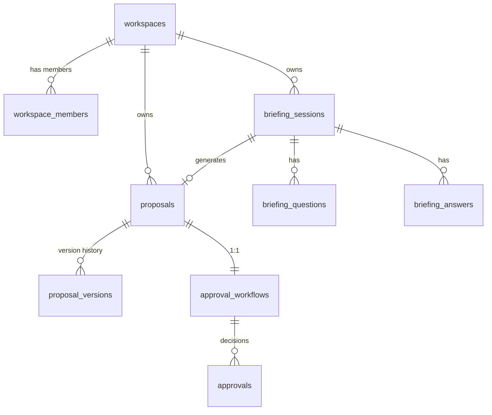

# Database Documentation

**Schema Version:** V9 (current)  
**Database:** PostgreSQL 16  
**Last Updated:** 2026-04-20

---

## Quick Start

### Run Migrations

```bash
cd backend
./mvnw flyway:migrate     # Apply pending migrations
./mvnw flyway:info        # Check migration status
./mvnw flyway:validate    # Verify checksums
```

### Connect to Database

```bash
# Local dev
docker compose exec postgres psql -U scopeflow -d scopeflow_dev

# User service DB (port 5433)
docker compose exec user-db psql -U postgres -d scopeflow_users
```

---

## Schema Overview

### Domain Structure

```
┌─────────────────────────────┐
│  User Service (DB-per-service, port 5433)
│  users · auth tokens         │
└─────────────────────────────┘

┌─────────────────────────────┐
│  Monolith (scopeflow_dev, port 5432)
│  workspaces · workspace_members
│  briefing_sessions · proposals
│  outbox · activity_logs      │
└─────────────────────────────┘
```

### Key Tables

| Table | Domain | Purpose |
|-------|--------|---------|
| `users` | User Service | User accounts (extracted via Strangler Fig) |
| `workspaces` | Workspace | Multi-tenant workspace root |
| `workspace_members` | Workspace | User-workspace memberships |
| `briefing_sessions` | Briefing | AI discovery sessions |
| `proposals` | Proposal | Generated proposals with approval workflow |
| `outbox` | Infrastructure | Event publishing (Outbox Pattern) |

---

## Migration History

| Version | Description | Status |
|---------|-------------|--------|
| V1 | Initial schema (superseded) | Applied |
| V2 | User & Workspace domain | Applied |
| V3 | Briefing domain | Applied |
| V4 | Proposal domain | Applied |
| V5 | User extraction preparation | Applied |
| V6 | Remove user foreign keys | Applied |
| V7 | Add ServiceUnavailableException guards | Applied |
| V8 | Idempotency table | Applied |
| V9 | Purge job configuration | Applied |

**User Service:**
- V1: Users table (DB-per-service, PostgreSQL on port 5433)

**Migration Rules:**
- ✅ **Never modify applied migrations** — Flyway will fail
- ✅ Always create V{n+1}__description.sql
- ✅ Test migrations with Testcontainers before applying to staging

---

## Performance Essentials

### Critical Indexes

| Table | Index | Why |
|-------|-------|-----|
| `proposals` | `(workspace_id, status)` | Primary query pattern: workspace-scoped + status filter |
| `proposal_versions` | `(proposal_id, created_at DESC)` | Latest versions without sort |
| `approval_workflows` | `proposal_id` (UNIQUE) | 1:1 relationship enforcement |
| `briefing_sessions` | `public_token` (UNIQUE) | Public link access |
| `outbox` | `published_at IS NULL` (partial) | Unpublished events only |

### Query Performance Checks

```sql
-- Find slow sequential scans
SELECT relname, seq_scan, idx_scan, n_live_tup
FROM pg_stat_user_tables
WHERE seq_scan > 100 AND idx_scan < seq_scan
ORDER BY seq_scan DESC LIMIT 10;

-- Find unused indexes (removal candidates)
SELECT schemaname, tablename, indexname, idx_scan,
       pg_size_pretty(pg_relation_size(indexrelid)) AS size
FROM pg_stat_user_indexes
WHERE idx_scan = 0 AND indexrelid NOT IN (
    SELECT indexrelid FROM pg_index WHERE indisprimary OR indisunique
)
ORDER BY pg_relation_size(indexrelid) DESC;

-- Table sizes
SELECT tablename,
       pg_size_pretty(pg_total_relation_size('public.'||tablename)) AS total_size
FROM pg_tables
WHERE schemaname = 'public'
ORDER BY pg_total_relation_size('public.'||tablename) DESC;
```

---

## Troubleshooting

### Flyway Checksum Mismatch

```bash
# Check which migration failed
./mvnw flyway:info

# Repair (use with caution — only if you're sure)
./mvnw flyway:repair
```

**Never modify applied migrations.** Create a new migration instead.

### Query Performance Issues

```sql
-- Analyze specific query
EXPLAIN (ANALYZE, BUFFERS)
SELECT * FROM proposals WHERE workspace_id = '...' AND status = 'DRAFT';

-- Update statistics
ANALYZE proposals;
ANALYZE proposal_versions;
```

**Red flags in EXPLAIN:**
- `Seq Scan` on large tables → missing index
- `Sort` node with disk spill → index order mismatch
- High `Rows Removed by Filter` → composite index needed

### Connection Issues

```bash
# Check if PostgreSQL is running
docker compose ps postgres

# View logs
docker logs scopeflow-postgres -f

# Restart if needed
docker compose restart postgres
```

---

## Schema Diagram



---

## Key Conventions

### Naming

- **Tables:** `snake_case`, plural (`proposals`, `workspace_members`)
- **Columns:** `snake_case` (`workspace_id`, `created_at`)
- **Indexes:** `idx_{table}_{columns}` or `uk_{table}_{constraint}` (unique)
- **Foreign keys:** `fk_{table}_{ref_table}`

### Standard Columns

Every domain table includes:
- `id UUID PRIMARY KEY DEFAULT gen_random_uuid()`
- `created_at TIMESTAMPTZ DEFAULT CURRENT_TIMESTAMP`
- `updated_at TIMESTAMPTZ` (with trigger)

### Multi-Tenancy

**All queries MUST filter by `workspace_id`** for tenant isolation.

```sql
-- ❌ WRONG (returns data from all workspaces)
SELECT * FROM proposals WHERE status = 'DRAFT';

-- ✅ CORRECT (workspace-scoped)
SELECT * FROM proposals 
WHERE workspace_id = '...' AND status = 'DRAFT';
```

---

## Architecture Decisions

| Decision | Rationale |
|----------|-----------|
| DB-per-service for users | User Service extracted via Strangler Fig — isolated schema on port 5433 |
| No FK for `client_id` | Clients are external entities; no cross-domain FK |
| `proposal_versions` CASCADE on delete | Versions are subordinate to proposal aggregate |
| UNIQUE(proposal_id) on workflows | Business invariant: 1 workflow per proposal |
| Outbox table for events | Transactional event publishing (exactly-once delivery) |
| Partial indexes on status | Small, fast indexes for active/pending records only |

---

## Useful Commands

```bash
# Apply migrations from scratch (destructive)
cd backend && ./mvnw flyway:clean flyway:migrate

# Generate ER diagram (requires PostgreSQL client + graphviz)
pg_dump -U scopeflow -d scopeflow_dev --schema-only | \
  java -jar schemacrawler.jar --server=postgresql --command=schema

# Export schema to SQL file
docker compose exec postgres pg_dump -U scopeflow -d scopeflow_dev \
  --schema-only -f /tmp/schema.sql
```

---

## See Also

- [Migration Guide](../migration/DB-MIGRATION-USER-SERVICE.md) — User service cut-over steps
- [CLAUDE.md](../../CLAUDE.md) — Full development guidelines
- [README.md](../../README.md) — Project setup and API docs

---

## Archive

Detailed reference documentation moved to `archive/` for historical record:
- `archive/flyway-changelog.md` — Complete migration history V1-V9
- `archive/index-strategy.md` — Full index inventory and decision framework
- `archive/query-performance-baseline.md` — EXPLAIN ANALYZE baselines and anti-patterns
- `archive/schema-diagram.md` — Complete ER diagram with state machines
