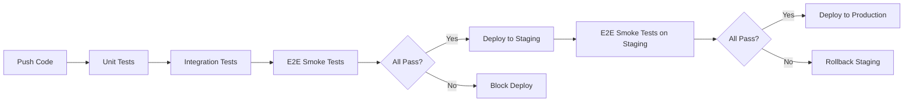

# E2E Testing Strategy - Strangler Fig Migration

## Context

This project is migrating authentication from the monolith to a standalone user-service using the **Strangler Fig pattern**. E2E smoke tests are critical to validate the migration is safe before production rollout.

---

## Test Pyramid

```
         /\
        /  \       E2E Smoke Tests (7 scenarios)
       /────\      ← You are here
      /      \     Integration Tests (Testcontainers)
     /────────\    
    /          \   Unit Tests (JUnit 5)
   /____________\  
```

**E2E tests cover:**
- Critical user flows (authentication)
- Cross-service compatibility (JWT)
- Regression detection (both modes)
- Production-like environment (Docker Compose)

**Not covered by E2E:**
- Edge cases (unit tests)
- Database constraints (integration tests)
- Performance under load (load tests)

---

## Strangler Fig Migration Phases

### Phase 1: Feature Flag Off (Current)
```
┌─────────────┐
│   Client    │
└──────┬──────┘
       │
       ▼
┌─────────────┐
│  Monolith   │ ← All auth requests
│  (port 8080)│
└─────────────┘
```

**Test:** `AUTH_SERVICE_EXTRACTED=false`
- Validates monolith auth works (baseline)

---

### Phase 2: Feature Flag On (Migration)
```
┌─────────────┐
│   Client    │
└──────┬──────┘
       │
       ▼
┌─────────────┐
│  Traefik    │
└──────┬──────┘
       │
       ├─────────────────┐
       ▼                 ▼
┌─────────────┐   ┌─────────────┐
│User Service │   │  Monolith   │
│ (port 8081) │   │ (port 8080) │
│             │   │             │
│ /api/v1/auth│   │ (other)     │
└─────────────┘   └─────────────┘
```

**Test:** `AUTH_SERVICE_EXTRACTED=true`
- Validates user-service auth works
- **Critical:** JWT from user-service is accepted by monolith
- Rollback plan: set flag to `false` and restart

---

### Phase 3: Complete Migration (Future)
```
┌─────────────┐
│   Client    │
└──────┬──────┘
       │
       ├─────────────────┐
       ▼                 ▼
┌─────────────┐   ┌─────────────┐
│User Service │   │  Monolith   │
│             │   │ (no auth)   │
└─────────────┘   └─────────────┘
```

**Test:** Remove feature flag, update integration
- Auth code removed from monolith
- Direct routing (no proxy)

---

## Test Scenarios

### 1. Happy Paths (Functional Validation)

| Test | Scenario | Validates |
|------|----------|-----------|
| 1 | Register new user | User creation + JWT generation |
| 2 | Login with valid credentials | Authentication flow |
| 3 | Get user profile (/auth/me) | JWT authentication |
| 4 | Access workspace endpoint | **JWT cross-service compatibility** |

**Test 4 is critical:** Proves JWT generated by user-service is accepted by monolith. Failure blocks migration.

---

### 2. Error Paths (Security Validation)

| Test | Scenario | Validates |
|------|----------|-----------|
| 5 | Invalid credentials | 401 + RFC 9457 error |
| 6 | Expired JWT | 401 rejection |
| 7 | Malformed JWT | 401 rejection |

Ensures error handling is consistent across both modes.

---

## JWT Compatibility

### What We Validate

1. **Format:** 3 parts (header.payload.signature)
2. **Claims:** `sub` (user ID), `exp` (expiration)
3. **Signature:** Implicitly validated when monolith accepts JWT
4. **Expiration:** `exp` must be in the future

### Example JWT Payload

```json
{
  "sub": "f47ac10b-58cc-4372-a567-0e02b2c3d479",
  "email": "smoke-test@example.com",
  "exp": 1712346578,
  "iat": 1712345678
}
```

### Common Failures

| Symptom | Cause | Fix |
|---------|-------|-----|
| Test 4 returns 401 | JWT_SECRET mismatch | Sync secrets in both services |
| Test 4 returns 500 | Missing JWT claim | Add claim to user-service |
| Test 3 passes, Test 4 fails | User-service JWT valid, monolith rejects | Check monolith JWT validation logic |

---

## Rollback Strategy

### Immediate Rollback (< 5 minutes)

If E2E tests fail in staging/production:

```bash
# 1. Set feature flag to false
echo "AUTH_SERVICE_EXTRACTED=false" >> .env

# 2. Restart backend (picks up new env var)
docker compose restart backend

# 3. Verify rollback worked
./tests/e2e/auth-flow.test.sh
```

**Impact:**
- Zero downtime (monolith handles auth again)
- Active JWT tokens remain valid
- No data loss

---

### Partial Rollback (Canary)

Enable user-service for 10% of traffic:

```yaml
# docker-compose.yml (Traefik weighted routing)
labels:
  - "traefik.http.services.auth.loadbalancer.sticky=true"
  - "traefik.http.services.auth.loadbalancer.server.weight=10"  # 10%
```

Monitor metrics:
- Error rate (Prometheus)
- JWT validation failures (logs)
- Latency p95/p99

Rollback if error rate > 1% or p95 latency > 200ms.

---

## CI/CD Integration

### Pre-Deployment Gates



**Deployment blocked if:**
- Any E2E test fails
- JWT compatibility check fails (Test 4)
- Response time > 500ms

---

## Monitoring & Alerts

### Key Metrics to Track

| Metric | Threshold | Alert |
|--------|-----------|-------|
| E2E test pass rate | < 100% | Immediate (critical) |
| JWT validation failure rate | > 0.5% | Page on-call |
| /auth/* endpoint latency (p95) | > 200ms | Warning |
| User-service error rate | > 1% | Page on-call |

### Grafana Dashboard

```
┌────────────────────────────────────────────────────┐
│ Auth Service Migration - Health Dashboard         │
├────────────────────────────────────────────────────┤
│ Feature Flag Status:        [ON] / OFF            │
│ E2E Test Pass Rate:         100% ✅                │
│ JWT Validation Failures:    0.01% ✅              │
│ /auth/* Latency (p95):      89ms ✅                │
│ User-service Error Rate:    0.02% ✅              │
├────────────────────────────────────────────────────┤
│ Graphs: Request rate | Error rate | Latency       │
└────────────────────────────────────────────────────┘
```

---

## Performance Benchmarks

### Test Execution Time

| Environment | Monolith Mode | User-Service Mode |
|-------------|--------------|-------------------|
| Local (dev) | 85s | 115s |
| CI (GitHub Actions) | 2m 30s | 3m 15s |
| Staging | 45s | 60s |

**Why faster in staging?** Pre-built JARs, cached Docker images.

---

### Load Test Targets

| Metric | Baseline (Monolith) | Target (User-Service) |
|--------|---------------------|----------------------|
| Requests/sec | 100 req/s | 100 req/s (same) |
| Latency (p95) | 120ms | < 150ms (25% tolerance) |
| Error rate | 0.01% | < 0.05% |
| Database connections | 10-20 | 10-20 (user-service) + 10-20 (monolith) |

---

## Test Data Management

### Test Users

- **Generation:** Timestamp-based emails (`smoke-test-1712345678@example.com`)
- **Isolation:** Each run creates unique users
- **Cleanup:** Deleted automatically on test completion
- **Retention:** 0 days (no test data persists)

### Database State

- **Before test:** Clean state (no test users)
- **During test:** Test user + JWT token
- **After test:** Test user deleted (or marked inactive)

### Idempotency

Tests are idempotent:
- Multiple runs don't interfere with each other
- Failures don't corrupt database
- Can run in parallel (different test emails)

---

## Security Considerations

### Secrets Management

| Secret | Storage | Access |
|--------|---------|--------|
| JWT_SECRET | `.env` (gitignored) | Backend + user-service |
| Database password | `.env` | PostgreSQL + services |
| OpenAI API key | `.env` | Backend only |
| GitHub Actions secrets | Repository settings | CI/CD only |

**Never commit:**
- `.env` file
- JWT_SECRET values
- Production credentials

---

### JWT Signing Key Rotation

When rotating JWT_SECRET:

1. **Add new secret** to both services
2. **Deploy services** (both accept old + new keys)
3. **Wait 15 minutes** (old tokens expire)
4. **Remove old secret** from both services
5. **Run E2E tests** to validate

**Downtime:** 0 minutes (dual-key period covers all active tokens)

---

## Troubleshooting Runbook

### Problem: Test 4 fails with 401 (JWT rejected by monolith)

**Diagnosis:**
```bash
# 1. Check JWT secrets match
grep JWT_SECRET .env
grep JWT_SECRET user-service/src/main/resources/application.yml

# 2. Decode JWT from user-service
export JWT_TOKEN=$(curl -s -X POST http://localhost:8081/api/v1/auth/login \
  -H "Content-Type: application/json" \
  -d '{"email":"test@example.com","password":"password123"}' | grep -o '"accessToken":"[^"]*' | cut -d'"' -f4)

echo $JWT_TOKEN | cut -d'.' -f2 | base64 -d | jq .

# 3. Check monolith logs for JWT validation errors
docker logs scopeflow-backend | grep "JWT"
```

**Fix:**
- Sync JWT_SECRET in both `.env` and `user-service/application.yml`
- Rebuild: `docker compose build --no-cache`
- Restart: `docker compose up -d`

---

### Problem: Test times out (service not ready)

**Diagnosis:**
```bash
# Check service health
curl http://localhost:8080/actuator/health
curl http://localhost:8081/actuator/health

# Check logs
docker logs scopeflow-backend -f
docker logs scopeflow-user-service -f

# Check database
docker logs scopeflow-postgres | grep ERROR
```

**Fix:**
- Increase health check timeout (default: 120s)
- Check database migrations: `./mvnw flyway:info`
- Check resource limits: increase Docker memory to 4GB+

---

### Problem: Traefik not routing to user-service

**Diagnosis:**
```bash
# Run routing validator
./tests/e2e/validate-traefik-routing.sh

# Check Traefik logs
docker logs scopeflow-traefik | grep "user-service"

# Test direct access
curl http://localhost:8081/actuator/health
```

**Fix:**
- Verify Traefik labels in `docker-compose.yml`
- Restart Traefik: `docker compose restart traefik`
- Check network: `docker network inspect scopeflow-network`

---

## Future Improvements

### Short-term (Next Sprint)

- [ ] Add contract tests (Pact) for user-service
- [ ] Add load tests (Gatling) for /auth/* endpoints
- [ ] Add chaos testing (Chaos Monkey) to simulate failures
- [ ] Add mutation testing (PIT) for JWT validation logic

### Long-term (Next Quarter)

- [ ] Migrate to Playwright for browser-based E2E tests
- [ ] Add visual regression tests (Percy) for login UI
- [ ] Implement continuous testing in production (synthetic monitoring)
- [ ] Add A/B testing framework for gradual rollout

---

## References

- [Strangler Fig Pattern - Martin Fowler](https://martinfowler.com/bliki/StranglerFigApplication.html)
- [RFC 9457 - Problem Details for HTTP APIs](https://www.rfc-editor.org/rfc/rfc9457.html)
- [JWT Best Practices - OWASP](https://cheatsheetseries.owasp.org/cheatsheets/JSON_Web_Token_for_Java_Cheat_Sheet.html)
- [Test Pyramid - Martin Fowler](https://martinfowler.com/articles/practical-test-pyramid.html)
- [Microservice Testing - Sam Newman](https://www.oreilly.com/library/view/building-microservices/9781491950340/)

---

## Contact

For questions or issues:
1. Check `tests/e2e/README.md` (troubleshooting section)
2. Review example outputs in `tests/e2e/EXAMPLE-OUTPUT.md`
3. Open GitHub issue with logs and test output
4. Slack: #scopeflow-engineering
